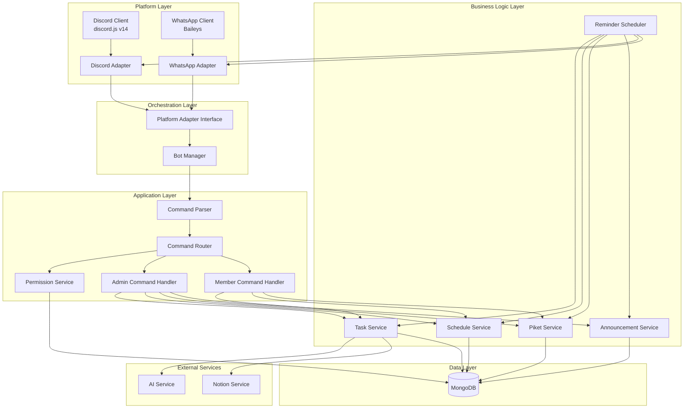

# Design Document: Discord Integration

## Overview

The Discord Integration extends the existing WhatsApp Class Reminder Bot to support Discord as an additional communication platform. The design follows an adapter pattern that abstracts platform-specific details, allowing the existing business logic layer to remain unchanged while supporting both WhatsApp and Discord simultaneously.

### Key Design Decisions

1. **discord.js v14**: Latest stable version with full TypeScript support, slash command integration, and improved performance. Provides comprehensive Discord API coverage including embeds, permissions, and role management.

2. **Adapter Pattern for Platform Abstraction**: Implements a clean separation between platform-specific code (Discord/WhatsApp clients) and business logic. Each platform adapter converts platform-specific messages to a unified format and formats responses appropriately for the target platform.

3. **Shared Business Logic Layer**: All existing services (TaskService, ScheduleService, PiketService, AnnouncementService) remain completely unchanged. The adapter layer handles all platform translation, ensuring business logic is truly platform-agnostic.

4. **Simultaneous Multi-Platform Operation**: Both Discord and WhatsApp clients run in the same Node.js process, managed by a BotManager orchestrator. This enables real-time cross-platform broadcasting and unified logging.

5. **Discord Slash Commands**: Leverages Discord's native slash command system for better UX compared to text-based commands. Commands are registered with Discord API on startup, providing autocomplete and validation.

6. **Role-Based Permission Mapping**: Maps Discord server roles (@Ketua, @Wakil, @Koordinator) to the existing admin system, maintaining consistent permissions across platforms without duplicating permission logic.

7. **Discord Embeds for Rich Formatting**: Uses Discord's embed system for visually appealing, structured messages. Embeds provide better readability than plain text and support color coding for priority levels.

8. **Platform Field in Logs**: Adds platform tracking to all database operations, enabling usage analytics and platform-specific debugging without changing existing schemas.

## Architecture

### System Architecture Diagram



### Data Flow

1. **Discord Command Flow**:
   - Discord slash command → Discord client → Discord adapter → Unified message → Command parser → Permission check → Command router → Handler → Service layer → Response → Discord adapter → Discord embed → Discord client → Discord channel

2. **WhatsApp Command Flow** (unchanged):
   - WhatsApp message → Baileys client → WhatsApp adapter → Unified message → Command parser → Permission check → Command router → Handler → Service layer → Response → WhatsApp adapter → WhatsApp text → Baileys client → WhatsApp group

3. **Scheduled Reminder Flow** (multi-platform):
   - Cron trigger → Reminder scheduler → Service layer queries → AI formatting → Response builder → Discord adapter (embed) + WhatsApp adapter (text) → Both platforms simultaneously

4. **Cross-Platform Broadcast Flow**:
   - Admin command on any platform → Unified message → Broadcast handler → Message content → Discord adapter + WhatsApp adapter → Both platforms

## Components and Interfaces

### 1. Platform Abstraction Layer

#### PlatformAdapter Interface
```typescript
interface PlatformAdapter {
  // Platform identifier
  readonly platform: 'discord' | 'whatsapp'
  
  // Initialize platform client
  initialize(): Promise<void>
  
  // Send message to target
  sendMessage(target: string, content: MessageContent): Promise<void>
  
  // Send message with mentions
  sendMessageWithMentions(target: string, text: string, mentions: string[]): Promise<void>
  
  // Convert platform message to unified format
  toUnifiedMessage(rawMessage: any): UnifiedMessage
  
  // Format response for platform
  formatResponse(response: BotResponse): PlatformMessage
  
  // Check if user has permission
  getUserRole(userId: string): Promise<UserRole | null>
  
  // Get platform-specific user ID
  getUserId(rawMessage: any): string
  
  // Validate platform is ready
  isReady(): boolean
}

interface UnifiedMessage {
  sender_id: string          // Platform-agnostic user ID
  sender_name: string         // Display name
  platform: 'discord' | 'whatsapp'
  command: string             // Command name without /
  arguments: string[]         // Parsed arguments
  raw_message: any           // Original platform message
  channel_id?: string        // For Discord channels
  is_dm: boolean             // True if direct message
  timestamp: Date
}

interface MessageContent {
  text?: string
  embed?: EmbedData
  image?: Buffer
  mentions?: string[]
}

interface EmbedData {
  title?: string
  description?: string
  color?: number             // Hex color as number
  fields?: EmbedField[]
  footer?: string
  timestamp?: Date
}

interface EmbedField {
  name: string
  value: string
  inline?: boolean
}

interface PlatformMessage {
  content: MessageContent
  target: string
  platform: 'discord' | 'whatsapp'
}

interface BotResponse {
  success: boolean
  message: string
  data?: any
  embed?: EmbedData
  mentions?: string[]
}
```

#### DiscordAdapter
```typescript
class DiscordAdapter implements PlatformAdapter {
  readonly platform = 'discord'
  
  constructor(
    private client: Client,
    private config: DiscordConfig,
    private db: MongoDB
  )
  
  // Initialize Discord client and register slash commands
  async initialize(): Promise<void>
  
  // Register all slash commands with Discord API
  private async registerSlashCommands(): Promise<void>
  
  // Handle incoming slash command interactions
  private async handleInteraction(interaction: CommandInteraction): Promise<void>
  
  // Send message to Discord channel or DM
  async sendMessage(target: string, content: MessageContent): Promise<void>
  
  // Send message with Discord mentions
  async sendMessageWithMentions(target: string, text: string, mentions: string[]): Promise<void>
  
  // Convert Discord interaction to unified message
  toUnifiedMessage(interaction: CommandInteraction): UnifiedMessage
  
  // Format response as Discord embed or text
  formatResponse(response: BotResponse): PlatformMessage
  
  // Get user role from Discord roles
  async getUserRole(userId: string): Promise<UserRole | null>
  
  // Extract Discord user ID
  getUserId(interaction: CommandInteraction): string
  
  // Check if Discord client is ready
  isReady(): boolean
  
  // Map Discord roles to admin roles
  private mapDiscordRoleToAdminRole(roles: Collection<string, Role>): UserRole | null
  
  // Create Discord embed from data
  private createEmbed(embedData: EmbedData): EmbedBuilder
  
  // Validate Discord permissions in channel
  private async validatePermissions(channel: TextChannel): Promise<boolean>
  
  // Format task list as Discord embed
  formatTaskList(tasks: Task[]): EmbedData
  
  // Format schedule as Discord embed
  formatSchedule(schedules: Schedule[]): EmbedData
  
  // Format piket as Discord embed with mentions
  formatPiket(piket: Piket): { embed: EmbedData, mentions: string[] }
  
  // Format announcement as Discord embed
  formatAnnouncement(announcement: Announcement): EmbedData
}

interface DiscordConfig {
  token: string
  guildId: string
  channelId: string
  roleMappings: {
    ketua: string[]          // Discord role IDs for Ketua
    wakil: string[]          // Discord role IDs for Wakil
    koordinator: string[]    // Discord role IDs for Koordinator
  }
  mentionEnabled: boolean
  embedColors: {
    urgent: number           // Red: 0xFF0000
    penting: number          // Orange: 0xFFA500
    normal: number           // Green: 0x00FF00
    info: number             // Blue: 0x0000FF
    error: number            // Dark red: 0x8B0000
  }
}
```

#### WhatsAppAdapter
```typescript
class WhatsAppAdapter implements PlatformAdapter {
  readonly platform = 'whatsapp'
  
  constructor(
    private client: BaileysClient,
    private config: WhatsAppConfig,
    private db: MongoDB
  )
  
  // Initialize WhatsApp client (existing logic)
  async initialize(): Promise<void>
  
  // Send message to WhatsApp group or individual
  async sendMessage(target: string, content: MessageContent): Promise<void>
  
  // Send message with WhatsApp mentions
  async sendMessageWithMentions(target: string, text: string, mentions: string[]): Promise<void>
  
  // Convert WhatsApp message to unified format
  toUnifiedMessage(message: WAMessage): UnifiedMessage
  
  // Format response as WhatsApp text
  formatResponse(response: BotResponse): PlatformMessage
  
  // Get user role from database
  async getUserRole(phoneNumber: string): Promise<UserRole | null>
  
  // Extract WhatsApp phone number
  getUserId(message: WAMessage): string
  
  // Check if WhatsApp client is ready
  isReady(): boolean
  
  // Format embed data as plain text for WhatsApp
  private formatEmbedAsText(embedData: EmbedData): string
}

interface WhatsAppConfig {
  authDir: string
  groupId: string
  printQRInTerminal: boolean
}
```

### 2. Bot Manager (Orchestration Layer)

#### BotManager
```typescript
class BotManager {
  private discordAdapter: DiscordAdapter | null = null
  private whatsappAdapter: WhatsAppAdapter
  private adapters: Map<string, PlatformAdapter> = new Map()
  
  constructor(
    private config: BotManagerConfig,
    private commandRouter: CommandRouter,
    private reminderScheduler: ReminderScheduler,
    private db: MongoDB
  )
  
  // Initialize all platform clients
  async initialize(): Promise<void>
  
  // Initialize Discord client if enabled
  private async initializeDiscord(): Promise<void>
  
  // Initialize WhatsApp client
  private async initializeWhatsApp(): Promise<void>
  
  // Handle incoming message from any platform
  async handleMessage(message: UnifiedMessage): Promise<void>
  
  // Broadcast message to all platforms
  async broadcast(content: MessageContent, urgent: boolean): Promise<BroadcastResult>
  
  // Send message to specific platform
  async sendToPlatform(platform: 'discord' | 'whatsapp', target: string, content: MessageContent): Promise<void>
  
  // Get adapter for platform
  getAdapter(platform: 'discord' | 'whatsapp'): PlatformAdapter | null
  
  // Check health of all platforms
  async healthCheck(): Promise<PlatformHealth>
  
  // Shutdown all platform clients gracefully
  async shutdown(): Promise<void>
}

interface BotManagerConfig {
  discordEnabled: boolean
  whatsappEnabled: boolean
  discordConfig?: DiscordConfig
  whatsappConfig: WhatsAppConfig
}

interface BroadcastResult {
  discord: { success: boolean, error?: string }
  whatsapp: { success: boolean, error?: string }
}

interface PlatformHealth {
  discord: { connected: boolean, latency: number }
  whatsapp: { connected: boolean, latency: number }
}
```

### 3. Modified Command Router

#### CommandRouter (Enhanced)
```typescript
class CommandRouter {
  constructor(
    private permissionService: PermissionService,
    private adminHandler: AdminCommandHandler,
    private memberHandler: MemberCommandHandler,
    private botManager: BotManager
  )
  
  // Route unified message to appropriate handler
  async route(message: UnifiedMessage): Promise<BotResponse>
  
  // Validate command permissions
  private async validatePermissions(message: UnifiedMessage, command: string): Promise<boolean>
  
  // Log command execution with platform info
  private async logCommand(message: UnifiedMessage, response: BotResponse): Promise<void>
}
```

### 4. Modified Permission Service

#### PermissionService (Enhanced)
```typescript
class PermissionService {
  constructor(
    private db: MongoDB,
    private botManager: BotManager
  )
  
  // Check if user has admin role (platform-aware)
  async isAdmin(userId: string, platform: 'discord' | 'whatsapp'): Promise<boolean>
  
  // Get user role (platform-aware)
  async getUserRole(userId: string, platform: 'discord' | 'whatsapp'): Promise<UserRole | null>
  
  // Check if user can execute specific command
  async canExecuteCommand(userId: string, platform: 'discord' | 'whatsapp', command: string): Promise<boolean>
  
  // Link Discord user to member record
  async linkDiscordUser(phoneNumber: string, discordUserId: string): Promise<boolean>
  
  // Unlink Discord user from member record
  async unlinkDiscordUser(phoneNumber: string): Promise<boolean>
  
  // Get Discord user ID for member
  async getDiscordUserId(phoneNumber: string): Promise<string | null>
  
  // Validate Discord user exists in guild
  async validateDiscordUser(discordUserId: string): Promise<boolean>
}
```

### 5. Modified Reminder Scheduler

#### ReminderScheduler (Enhanced)
```typescript
class ReminderScheduler {
  constructor(
    private taskService: TaskService,
    private scheduleService: ScheduleService,
    private piketService: PiketService,
    private announcementService: AnnouncementService,
    private aiService: AIService,
    private botManager: BotManager,
    private config: SchedulerConfig
  )
  
  // Send daily recap to all platforms
  async sendDailyRecap(): Promise<void>
  
  // Send weekly recap to all platforms
  async sendWeeklyRecap(): Promise<void>
  
  // Build recap message for specific platform
  private async buildRecapForPlatform(date: Date, type: 'daily' | 'weekly', platform: 'discord' | 'whatsapp'): Promise<MessageContent>
  
  // Send recap to Discord
  private async sendToDiscord(content: MessageContent): Promise<void>
  
  // Send recap to WhatsApp
  private async sendToWhatsApp(content: MessageContent): Promise<void>
}
```

### 6. Discord-Specific Components

#### SlashCommandBuilder
```typescript
class SlashCommandBuilder {
  // Build slash command definitions from command metadata
  static buildCommands(commands: CommandMetadata[]): ApplicationCommandData[]
  
  // Build command options from argument definitions
  private static buildOptions(args: ArgumentDefinition[]): ApplicationCommandOptionData[]
  
  // Convert command to Discord slash command format
  private static toSlashCommand(command: CommandMetadata): ApplicationCommandData
}

interface CommandMetadata {
  name: string
  description: string
  arguments: ArgumentDefinition[]
  requiredRole: UserRole[]
  category: 'admin' | 'member'
}

interface ArgumentDefinition {
  name: string
  description: string
  type: 'string' | 'integer' | 'boolean' | 'user'
  required: boolean
  choices?: { name: string, value: string }[]
}
```

#### DiscordEmbedFormatter
```typescript
class DiscordEmbedFormatter {
  // Format task list as embed
  static formatTaskList(tasks: Task[], title: string): EmbedData
  
  // Format schedule as embed
  static formatSchedule(schedules: Schedule[], day: string): EmbedData
  
  // Format piket as embed with mentions
  static formatPiket(piket: Piket, discordUserIds: Map<string, string>): { embed: EmbedData, mentions: string[] }
  
  // Format announcement as embed
  static formatAnnouncement(announcement: Announcement): EmbedData
  
  // Format daily recap as embed
  static formatDailyRecap(data: RecapData): EmbedData
  
  // Format weekly recap as embed
  static formatWeeklyRecap(data: RecapData): EmbedData
  
  // Format error message as embed
  static formatError(error: string): EmbedData
  
  // Format help message as embed
  static formatHelp(commands: CommandMetadata[], userRole: UserRole): EmbedData
  
  // Get color for priority level
  private static getColorForPriority(priority: Priority): number
  
  // Get color for announcement type
  private static getColorForAnnouncementType(type: string): number
}
```

#### DiscordPermissionValidator
```typescript
class DiscordPermissionValidator {
  constructor(private client: Client)
  
  // Validate bot has required permissions in channel
  async validateChannelPermissions(channelId: string): Promise<ValidationResult>
  
  // Check specific permission
  async hasPermission(channelId: string, permission: PermissionFlagsBits): Promise<boolean>
  
  // Get missing permissions
  async getMissingPermissions(channelId: string, required: PermissionFlagsBits[]): Promise<PermissionFlagsBits[]>
  
  // Validate role exists in guild
  async validateRole(guildId: string, roleId: string): Promise<boolean>
}

interface ValidationResult {
  valid: boolean
  missingPermissions: string[]
  warnings: string[]
}
```

## Data Models

### Modified MongoDB Collections

#### members (Enhanced)
```javascript
{
  _id: ObjectId,
  nama: String,
  nomor_wa: String,        // unique index
  discord_user_id: String, // NEW: optional Discord user ID
  kelas: String,
  is_active: Boolean,
  created_at: Date,
  updated_at: Date
}
```

#### logs (Enhanced)
```javascript
{
  _id: ObjectId,
  action: String,
  user_wa: String,
  user_discord: String,    // NEW: optional Discord user ID
  platform: String,        // NEW: 'discord' or 'whatsapp'
  details: Object,
  status: String,
  created_at: Date
}
```

#### bot_config (New Entries)
```javascript
// Discord configuration entries
{ key: 'discord_enabled', value: 'true', description: 'Enable Discord integration' }
{ key: 'discord_token', value: '<bot_token>', description: 'Discord bot token' }
{ key: 'discord_guild_id', value: '<guild_id>', description: 'Discord server ID' }
{ key: 'discord_channel_id', value: '<channel_id>', description: 'Discord channel for reminders' }
{ key: 'discord_role_ketua', value: '<role_id>', description: 'Discord role ID for Ketua' }
{ key: 'discord_role_wakil', value: '<role_id>', description: 'Discord role ID for Wakil' }
{ key: 'discord_role_koordinator', value: '<role_id>', description: 'Discord role ID for Koordinator' }
{ key: 'discord_mention_enabled', value: 'true', description: 'Enable Discord mentions' }
```

### Database Indexes (Additional)

```javascript
// Add index for Discord user lookups
db.members.createIndex({ discord_user_id: 1 }, { sparse: true })

// Add compound index for platform-specific log queries
db.logs.createIndex({ platform: 1, created_at: -1 })
```

### Discord API Data Structures

#### Discord Interaction (from discord.js)
```typescript
interface CommandInteraction {
  id: string
  user: User
  guild: Guild
  channel: TextChannel | DMChannel
  options: CommandInteractionOptionResolver
  deferred: boolean
  
  deferReply(): Promise<void>
  editReply(content: string | MessagePayload): Promise<Message>
  reply(content: string | MessagePayload): Promise<Message>
}

interface User {
  id: string
  username: string
  discriminator: string
  tag: string
}

interface Guild {
  id: string
  name: string
  members: GuildMemberManager
  roles: RoleManager
}

interface Role {
  id: string
  name: string
  position: number
  permissions: PermissionsBitField
}
```


## Correctness Properties

*A property is a characteristic or behavior that should hold true across all valid executions of a system—essentially, a formal statement about what the system should do. Properties serve as the bridge between human-readable specifications and machine-verifiable correctness guarantees.*

### Discord Client Initialization Properties

**Property 1: Discord client initialization with valid token**
*For any* valid Discord bot token, initializing the Discord client should succeed and establish a connection.
**Validates: Requirements 1.1**

**Property 2: Connection success logging**
*For any* successful Discord connection, a log entry should be created containing the connection status and bot username.
**Validates: Requirements 1.2**

**Property 3: Connection failure retry mechanism**
*For any* Discord connection failure, the bot should log the error and attempt reconnection after 5 seconds.
**Validates: Requirements 1.3**

**Property 4: Configuration storage completeness**
*For any* Discord initialization, the bot_config collection should contain entries for discord_token, discord_guild_id, and discord_channel_id.
**Validates: Requirements 1.5**

**Property 5: Slash command registration on ready**
*For any* Discord client ready event, all available commands should be registered with the Discord API.
**Validates: Requirements 1.6**

**Property 6: Concurrent platform operation**
*For any* bot instance, both Discord and WhatsApp clients should be running and responding to messages simultaneously.
**Validates: Requirements 1.7**

### Slash Command Properties

**Property 7: Complete command registration**
*For any* command in the bot's command set, a corresponding Application_Command should be registered with Discord.
**Validates: Requirements 2.1**

**Property 8: Command metadata consistency**
*For any* registered slash command, its name, description, and options should match the corresponding command definition.
**Validates: Requirements 2.2**

**Property 9: Command context extraction**
*For any* received slash command interaction, the extracted Command_Context should contain the correct command name and option values.
**Validates: Requirements 2.3**

**Property 10: Deferred reply for long operations**
*For any* slash command execution, the bot should defer the reply before processing to prevent timeout.
**Validates: Requirements 2.4**

**Property 11: Deferred reply completion**
*For any* completed command processing, the deferred reply should be edited with the final response.
**Validates: Requirements 2.5**

**Property 12: Command option completeness**
*For any* command argument in the existing command set, a corresponding slash command option should exist.
**Validates: Requirements 2.6**

### Platform Adapter Properties

**Property 13: Adapter interface implementation**
*For any* platform (Discord or WhatsApp), the corresponding adapter should implement all methods defined in the PlatformAdapter interface.
**Validates: Requirements 3.1**

**Property 14: Message conversion to unified format**
*For any* platform-specific message, converting it through the adapter should produce a UnifiedMessage with all required fields.
**Validates: Requirements 3.2, 3.3**

**Property 15: Response formatting for target platform**
*For any* BotResponse and target platform, the adapter should format the response appropriately for that platform (embed for Discord, text for WhatsApp).
**Validates: Requirements 3.4**

**Property 16: Unified message routing**
*For any* UnifiedMessage created by an adapter, it should be routed through the command router.
**Validates: Requirements 3.5**

**Property 17: Adapter conversion error handling**
*For any* adapter conversion failure, the bot should log the error and return a generic error message without crashing.
**Validates: Requirements 3.6**

**Property 18: Adapter instance independence**
*For any* bot instance, separate PlatformAdapter instances should exist for Discord and WhatsApp, operating independently.
**Validates: Requirements 3.7**

### Role Mapping and Permission Properties

**Property 19: Discord role to admin role mapping**
*For any* Discord user with roles @Ketua, @Wakil, or @Koordinator, their admin role should map to ketua, wakil, or koordinator respectively.
**Validates: Requirements 4.1**

**Property 20: Role-based permission checking**
*For any* Discord command execution, the bot should verify the user's Discord roles before processing.
**Validates: Requirements 4.2**

**Property 21: Highest permission level selection**
*For any* Discord user with multiple mapped roles, the bot should use the role with the highest permission level.
**Validates: Requirements 4.3**

**Property 22: Default member role assignment**
*For any* Discord user without mapped roles, the bot should treat them as having member role permissions.
**Validates: Requirements 4.4**

**Property 23: Role mapping configuration storage**
*For any* Discord role mapping, it should be stored in the bot_config collection.
**Validates: Requirements 4.5**

**Property 24: Permission denied response**
*For any* command execution where the user lacks required permissions, the bot should respond with a permission denied message.
**Validates: Requirements 4.7**

### Discord Embed Formatting Properties

**Property 25: Task list embed structure**
*For any* task list display on Discord, the output should be a Discord_Embed with title, description, and fields.
**Validates: Requirements 5.1**

**Property 26: Schedule embed with color coding**
*For any* schedule display on Discord, the output should be a Discord_Embed with color-coded entries.
**Validates: Requirements 5.2**

**Property 27: Piket embed with mentions**
*For any* piket assignment display on Discord, the output should be a Discord_Embed including Discord_Mention for users with discord_user_id.
**Validates: Requirements 5.3**

**Property 28: Announcement embed color mapping**
*For any* announcement display on Discord, the embed color should correspond to the announcement tipe.
**Validates: Requirements 5.4**

**Property 29: Daily recap embed structure**
*For any* daily recap on Discord, the embed should contain sections for tasks, schedules, piket, and announcements.
**Validates: Requirements 5.5**

**Property 30: Weekly recap embed with statistics**
*For any* weekly recap on Discord, the embed should include statistics and categorized task lists.
**Validates: Requirements 5.6**

**Property 31: Priority color mapping**
*For any* task with priority level, the Discord embed color should be red (#FF0000) for urgent, orange (#FFA500) for penting, and green (#00FF00) for normal.
**Validates: Requirements 5.7**

### Discord Mention Properties

**Property 32: Discord user ID storage**
*For any* member record, it should support optional storage of discord_user_id alongside nomor_wa.
**Validates: Requirements 6.1**

**Property 33: Mention formatting for linked users**
*For any* piket assignment on Discord where users have discord_user_id, the display should use Discord_Mention format.
**Validates: Requirements 6.2**

**Property 34: Plain text fallback for unlinked users**
*For any* piket assignment on Discord where users lack discord_user_id, the display should show their name as plain text.
**Validates: Requirements 6.3**

**Property 35: Daily recap mention inclusion**
*For any* daily recap sent to Discord, piket assignments should include Discord_Mention for linked users.
**Validates: Requirements 6.4**

**Property 36: Discord user linking**
*For any* /link_discord command execution, the specified member's discord_user_id field should be updated with the provided Discord user ID.
**Validates: Requirements 6.5**

**Property 37: Invalid mention fallback**
*For any* invalid Discord_Mention, the bot should fallback to displaying the user's name as plain text.
**Validates: Requirements 6.6**

**Property 38: Discord user ID validation**
*For any* discord_user_id before storage, the bot should validate the format and reject invalid IDs.
**Validates: Requirements 6.7**

### Platform Logging Properties

**Property 39: Command execution platform logging**
*For any* command execution, the log entry should include a platform field indicating 'discord' or 'whatsapp'.
**Validates: Requirements 7.1**

**Property 40: Task creation platform logging**
*For any* task creation, the log entry should record which platform was used.
**Validates: Requirements 7.2**

**Property 41: Schedule update platform logging**
*For any* schedule update, the log entry should record which platform was used.
**Validates: Requirements 7.3**

**Property 42: Platform-specific error logging**
*For any* platform-specific error, the log entry should include the platform context.
**Validates: Requirements 7.6**

**Property 43: Separate platform error counters**
*For any* error occurrence, the bot should maintain separate error counts for Discord and WhatsApp.
**Validates: Requirements 7.7**

### Scheduled Reminder Properties

**Property 44: Daily recap Discord delivery**
*For any* daily reminder trigger, the bot should send the daily recap to the configured Discord_Channel.
**Validates: Requirements 8.1**

**Property 45: Weekly recap Discord delivery**
*For any* weekly reminder trigger, the bot should send the weekly recap to the configured Discord_Channel.
**Validates: Requirements 8.2**

**Property 46: Discord reminder embed formatting**
*For any* reminder sent to Discord, it should be formatted as a Discord_Embed with appropriate sections.
**Validates: Requirements 8.3**

**Property 47: Missing channel configuration handling**
*For any* reminder attempt when Discord_Channel is not configured, the bot should log a warning and skip Discord delivery.
**Validates: Requirements 8.4**

**Property 48: Message send retry mechanism**
*For any* Discord message send failure, the bot should retry up to 3 times with 2-second delays between attempts.
**Validates: Requirements 8.5**

**Property 49: Simultaneous multi-platform reminder delivery**
*For any* scheduled reminder, the bot should send it to both Discord and WhatsApp simultaneously.
**Validates: Requirements 8.6**

**Property 50: Platform failure isolation**
*For any* reminder delivery where one platform fails, the bot should continue sending to the other platform.
**Validates: Requirements 8.7**

### Discord Permission Validation Properties

**Property 51: Send messages permission validation**
*For any* Discord connection to a guild, the bot should verify it has Send Messages permission in the configured channel.
**Validates: Requirements 9.1**

**Property 52: Embed links permission validation**
*For any* Discord connection to a guild, the bot should verify it has Embed Links permission in the configured channel.
**Validates: Requirements 9.2**

**Property 53: Mention everyone permission validation**
*For any* Discord connection to a guild, the bot should verify it has Mention Everyone permission for piket notifications.
**Validates: Requirements 9.3**

**Property 54: Missing permission logging**
*For any* missing required permission, the bot should log a warning with the specific missing permission names.
**Validates: Requirements 9.4**

**Property 55: Permission error fallback notification**
*For any* message send failure due to missing permissions, the bot should log the error and send a notification via WhatsApp.
**Validates: Requirements 9.5**

**Property 56: Pre-send permission checking**
*For any* message about to be sent, the bot should check required permissions before attempting to send.
**Validates: Requirements 9.6**

### User Linking Properties

**Property 57: Discord user linking to member**
*For any* /link_discord command with valid nomor_wa and discord_user_id, the member record should be updated with the discord_user_id.
**Validates: Requirements 10.1**

**Property 58: Discord user unlinking**
*For any* /unlink_discord command with valid nomor_wa, the discord_user_id should be removed from the member record.
**Validates: Requirements 10.2**

**Property 59: Unlinked user default permissions**
*For any* Discord user executing a command without being linked to a member record, they should be treated as guest with view-only permissions.
**Validates: Requirements 10.3**

**Property 60: Linked user display completeness**
*For any* linked user display, both nomor_wa and discord_user_id should be shown.
**Validates: Requirements 10.4**

**Property 61: Discord user ID guild validation**
*For any* /link_discord command, the bot should validate that the discord_user_id exists in the Discord_Guild before linking.
**Validates: Requirements 10.5**

**Property 62: Invalid linking error response**
*For any* /link_discord command with invalid discord_user_id, the bot should return an error message.
**Validates: Requirements 10.6**

### Channel and DM Support Properties

**Property 63: Channel command processing**
*For any* slash command received in a Discord_Channel, the bot should process it normally.
**Validates: Requirements 11.1**

**Property 64: DM command processing**
*For any* slash command received in a DM, the bot should process it with the same logic as channel commands.
**Validates: Requirements 11.2**

**Property 65: Reminder channel-only delivery**
*For any* scheduled reminder, the bot should send it only to the configured Discord_Channel, not to DMs.
**Validates: Requirements 11.3**

**Property 66: DM admin command permission validation**
*For any* admin command executed in DM, the bot should verify permissions and process normally if authorized.
**Validates: Requirements 11.5**

**Property 67: Command execution context logging**
*For any* command execution, the log should indicate whether it was executed in a channel or DM.
**Validates: Requirements 11.6**

**Property 68: Channel-only command DM rejection**
*For any* command that requires channel context, execution in DM should be rejected with an appropriate message.
**Validates: Requirements 11.7**

### Broadcast Properties

**Property 69: Discord broadcast delivery**
*For any* /broadcast command executed on Discord, the message should be sent to the configured Discord_Channel.
**Validates: Requirements 12.1**

**Property 70: Urgent broadcast formatting**
*For any* /broadcast_urgent command on Discord, the message should be sent as a Discord_Embed with red color.
**Validates: Requirements 12.2**

**Property 71: Broadcast logging completeness**
*For any* broadcast command, the log should include sender, platform, and message content.
**Validates: Requirements 12.5**

**Property 72: Cross-platform broadcast delivery**
*For any* broadcast command executed on any platform, the message should be sent to both Discord and WhatsApp.
**Validates: Requirements 12.7**

### Error Handling and Reconnection Properties

**Property 73: Disconnection logging**
*For any* Discord client disconnection, the bot should log the disconnection reason.
**Validates: Requirements 13.1**

**Property 74: Automatic reconnection on recoverable disconnect**
*For any* recoverable Discord disconnection, the bot should attempt automatic reconnection.
**Validates: Requirements 13.2**

**Property 75: Rate limit respect**
*For any* Discord API rate limit error, the bot should respect the retry-after header before retrying.
**Validates: Requirements 13.4**

**Property 76: Client error handling**
*For any* Discord API 4xx error, the bot should log the error and return a user-friendly message without retrying.
**Validates: Requirements 13.5**

**Property 77: Server error retry**
*For any* Discord API 5xx error, the bot should retry the request up to 3 times.
**Validates: Requirements 13.6**

**Property 78: Platform failure isolation**
*For any* Discord disconnection or failure, WhatsApp operations should continue normally.
**Validates: Requirements 13.7**

### Help and Documentation Properties

**Property 79: Help command embed formatting**
*For any* /help command on Discord, the response should be formatted as a Discord_Embed.
**Validates: Requirements 14.1**

**Property 80: Role-based help filtering**
*For any* /help command, the displayed commands should be filtered based on the user's Discord_Role permissions.
**Validates: Requirements 14.2**

**Property 81: Specific command help**
*For any* /help command with a command name argument, the response should display detailed usage for that specific command.
**Validates: Requirements 14.3**

**Property 82: Help message completeness**
*For any* help message, it should include command descriptions, required options, and examples.
**Validates: Requirements 14.4**

**Property 83: Slash command description inclusion**
*For any* registered slash command, it should include a description that appears in Discord's command picker.
**Validates: Requirements 14.5**

**Property 84: Error message usage instructions**
*For any* command failure due to invalid arguments, the error message should include usage instructions.
**Validates: Requirements 14.7**

### Configuration Management Properties

**Property 85: Environment variable configuration loading**
*For any* bot startup, Discord configuration should be loaded from environment variables DISCORD_TOKEN, DISCORD_GUILD_ID, and DISCORD_CHANNEL_ID.
**Validates: Requirements 15.1**

**Property 86: Runtime configuration storage**
*For any* Discord runtime configuration, it should be stored in the bot_config collection.
**Validates: Requirements 15.2**

**Property 87: Configuration key support**
*For any* Discord configuration, the bot should support keys: discord_enabled, discord_role_mappings, and discord_mention_enabled.
**Validates: Requirements 15.3**

**Property 88: Conditional Discord initialization**
*For any* bot startup where discord_enabled is false, Discord client initialization should be skipped.
**Validates: Requirements 15.4**

**Property 89: Configuration validation**
*For any* Discord configuration update, the bot should validate all values before applying them.
**Validates: Requirements 15.7**

## Error Handling

### Error Categories and Strategies

#### 1. Discord Connection Errors
- **Invalid Token**: Log error with token prefix (first 10 chars), exit with error code, notify via WhatsApp if possible
- **Guild Not Found**: Log error with guild ID, exit with error code, provide clear message about bot not being in server
- **Channel Not Found**: Log error with channel ID, disable Discord reminders, continue with WhatsApp only
- **Connection Timeout**: Retry with exponential backoff (1s, 2s, 4s, 8s, 16s) up to 5 attempts
- **WebSocket Disconnect**: Attempt automatic reconnection, log disconnect reason, notify admins if reconnection fails

#### 2. Discord API Errors
- **Rate Limit (429)**: Respect retry-after header, queue requests, log rate limit events
- **Bad Request (400)**: Log full error details, return user-friendly message, don't retry
- **Unauthorized (401)**: Log error, check token validity, exit if token is invalid
- **Forbidden (403)**: Log missing permissions, attempt to identify specific permission, notify via WhatsApp
- **Not Found (404)**: Log error, validate resource IDs, return appropriate error message
- **Server Error (5xx)**: Retry up to 3 times with 5-second delay, log all attempts, fallback to WhatsApp if all fail

#### 3. Slash Command Errors
- **Registration Failure**: Log error with command details, continue with existing registrations, retry on next startup
- **Interaction Timeout**: Ensure deferred reply is sent within 3 seconds, edit reply with error if processing exceeds 15 minutes
- **Invalid Options**: Validate options before processing, return clear error message with expected format
- **Permission Denied**: Check user roles, return permission denied message with required role information

#### 4. Platform Adapter Errors
- **Conversion Failure**: Log full error context, return generic error message, don't crash adapter
- **Formatting Failure**: Log error, fallback to plain text format, ensure message is still delivered
- **Missing Required Fields**: Validate UnifiedMessage structure, log missing fields, reject invalid messages
- **Platform Mismatch**: Validate platform field, log mismatch, route to correct adapter

#### 5. Role Mapping Errors
- **Invalid Role ID**: Log error with role ID, skip invalid mapping, use default member role
- **Role Not Found**: Log warning, check if role was deleted, update configuration
- **Multiple Role Conflict**: Use highest permission level, log conflict for admin review
- **Missing Role Configuration**: Use default mappings, log warning, notify admin to configure roles

#### 6. Embed Formatting Errors
- **Embed Too Large**: Discord has 6000 character limit for embeds, truncate content with "..." indicator
- **Invalid Color Code**: Validate hex color, fallback to default color (blue #0000FF)
- **Missing Required Fields**: Provide default values, log warning, ensure embed is still valid
- **Field Count Limit**: Discord allows max 25 fields, paginate or summarize if exceeded

#### 7. Mention Errors
- **Invalid User ID**: Validate format (snowflake ID), fallback to plain text name
- **User Not in Guild**: Check guild membership, fallback to plain text name
- **Missing discord_user_id**: Use plain text name, log for admin to link user
- **Mention Permission Denied**: Check bot permissions, fallback to plain text, log permission issue

#### 8. Multi-Platform Errors
- **Partial Broadcast Failure**: Log which platform failed, continue with successful platforms, notify admin
- **Platform Unavailable**: Check platform health, skip unavailable platform, log warning
- **Concurrent Operation Conflict**: Use proper locking/queuing, ensure operations don't interfere
- **Cross-Platform Data Inconsistency**: Validate data before cross-platform operations, log inconsistencies

### Error Response Format

All Discord error responses should use embeds:
```typescript
{
  embed: {
    title: '❌ Error',
    description: 'User-friendly error message',
    color: 0x8B0000,  // Dark red
    fields: [
      { name: 'Error Code', value: 'ERROR_CODE', inline: true },
      { name: 'Command', value: '/command_name', inline: true }
    ],
    footer: 'Use /help for command usage',
    timestamp: new Date()
  }
}
```

### Error Logging Strategy

All errors should be logged with:
- Timestamp
- Platform ('discord' or 'whatsapp')
- Error type/category
- Error message
- Stack trace (for exceptions)
- Context (user, command, guild, channel)
- Severity level (warning, error, critical)

Critical Discord errors (connection failure, permission issues) should trigger admin notifications via WhatsApp as fallback.

## Testing Strategy

### Dual Testing Approach

The testing strategy employs both unit testing and property-based testing as complementary approaches:

- **Unit Tests**: Verify specific examples, edge cases, and error conditions for Discord integration
- **Property Tests**: Verify universal properties across all inputs through randomization
- Together they provide comprehensive coverage: unit tests catch concrete Discord-specific bugs, property tests verify general correctness

### Property-Based Testing Configuration

**Library Selection**: Use `fast-check` for Node.js/TypeScript property-based testing

**Test Configuration**:
- Minimum 100 iterations per property test (due to randomization)
- Each property test must reference its design document property
- Tag format: `// Feature: discord-integration, Property {number}: {property_text}`

**Example Property Test Structure**:
```typescript
import fc from 'fast-check';

// Feature: discord-integration, Property 14: Message conversion to unified format
test('Platform adapter converts any Discord message to valid UnifiedMessage', () => {
  fc.assert(
    fc.property(
      fc.record({
        user: fc.record({ id: fc.string(), username: fc.string() }),
        content: fc.string(),
        channelId: fc.string(),
        guildId: fc.string()
      }),
      (mockInteraction) => {
        const adapter = new DiscordAdapter(mockClient, config, db);
        const unified = adapter.toUnifiedMessage(mockInteraction);
        
        expect(unified).toHaveProperty('sender_id');
        expect(unified).toHaveProperty('sender_name');
        expect(unified).toHaveProperty('platform');
        expect(unified).toHaveProperty('command');
        expect(unified).toHaveProperty('arguments');
        expect(unified).toHaveProperty('raw_message');
        expect(unified.platform).toBe('discord');
      }
    ),
    { numRuns: 100 }
  );
});
```

### Unit Testing Strategy

**Framework**: Jest for Node.js/TypeScript

**Test Organization**:
- One test file per adapter/component class
- Group related tests using `describe` blocks
- Use `beforeEach` for test setup and cleanup
- Mock Discord.js client and interactions

**Coverage Targets**:
- Discord adapter: 90%+ coverage
- Platform abstraction layer: 95%+ coverage
- Bot manager: 85%+ coverage
- Slash command builder: 90%+ coverage
- Embed formatter: 90%+ coverage

**Key Unit Test Areas**:
1. Discord slash command registration and parsing
2. Role mapping from Discord roles to admin roles
3. Embed formatting for different message types
4. Permission validation in Discord channels
5. User linking between WhatsApp and Discord
6. Error handling for Discord API errors
7. Multi-platform broadcast functionality
8. Platform adapter conversion (Discord ↔ Unified format)
9. Mention formatting and fallback behavior
10. Configuration loading and validation

### Integration Testing

**Test Scenarios**:
1. End-to-end Discord command execution flow
2. Multi-platform reminder delivery (Discord + WhatsApp)
3. Cross-platform broadcast from Discord to WhatsApp
4. Role-based permission checking across platforms
5. Discord reconnection and error recovery
6. User linking and mention resolution
7. Concurrent operation of both platform clients
8. Platform failure isolation (Discord fails, WhatsApp continues)

**Test Environment**:
- Use MongoDB in-memory server for database tests
- Mock Discord.js client with test guild/channel/user data
- Mock WhatsApp client for cross-platform tests
- Use Discord.js test utilities for interaction mocking

### Discord-Specific Testing

**Mock Discord Structures**:
```typescript
// Mock Discord client
const mockClient = {
  guilds: {
    cache: new Map([
      ['guild-id', mockGuild]
    ])
  },
  on: jest.fn(),
  login: jest.fn()
};

// Mock Discord interaction
const mockInteraction = {
  user: { id: 'user-id', username: 'testuser' },
  guild: mockGuild,
  channel: mockChannel,
  options: {
    getString: jest.fn(),
    getInteger: jest.fn(),
    getUser: jest.fn()
  },
  deferReply: jest.fn(),
  editReply: jest.fn()
};

// Mock Discord embed
const mockEmbed = {
  setTitle: jest.fn().mockReturnThis(),
  setDescription: jest.fn().mockReturnThis(),
  setColor: jest.fn().mockReturnThis(),
  addFields: jest.fn().mockReturnThis(),
  setFooter: jest.fn().mockReturnThis(),
  setTimestamp: jest.fn().mockReturnThis()
};
```

**Test Cases for Discord Features**:
1. Slash command registration with various option types
2. Embed creation with different field counts and sizes
3. Role hierarchy and permission precedence
4. Mention formatting with valid and invalid user IDs
5. Channel vs DM command handling
6. Permission validation for different channel types
7. Rate limit handling and retry logic
8. WebSocket reconnection scenarios

### Testing Best Practices

1. **Isolation**: Each test should be independent and not rely on Discord API
2. **Mocking**: Mock all Discord.js components to avoid external dependencies
3. **Determinism**: Tests should produce consistent results across runs
4. **Speed**: Unit tests should complete in milliseconds
5. **Clarity**: Test names should clearly describe Discord-specific behavior
6. **Maintainability**: Use test helpers and factories for Discord mock objects
7. **Coverage**: Focus on adapter layer and platform-specific logic

### Continuous Testing

- Run unit tests on every commit
- Run property tests on pull requests
- Run integration tests before deployment
- Monitor test execution time and optimize slow tests
- Track flaky tests related to Discord mocking and fix root causes
- Validate against Discord API changes with integration tests

