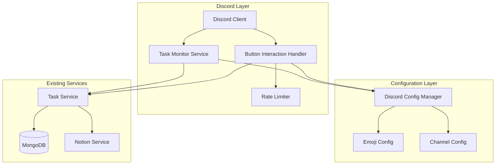
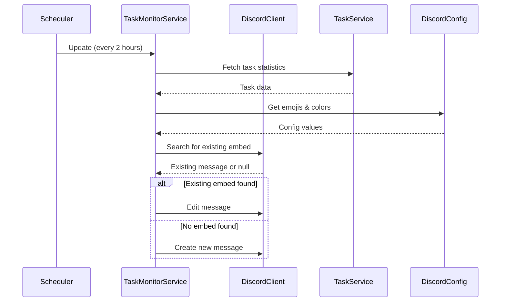

# Design Document: Discord Task Monitor

## Overview

The Discord Task Monitor feature extends the existing WhatsApp Class Reminder Bot with a comprehensive Discord monitoring system. The feature provides an auto-updating embed that displays real-time task statistics, interactive buttons for quick task queries, and a fully configurable Discord-specific configuration system.

The design follows a service-oriented architecture, integrating seamlessly with existing TaskService and database infrastructure while adding Discord-specific components for embed management, button interactions, rate limiting, and configuration management.

## Architecture

### High-Level Architecture



### Component Interaction Flow



## Components and Interfaces

### 1. Discord Configuration Manager

**Purpose**: Centralized management of all Discord-specific configuration including emojis, colors, channels, and activity templates.

**Interface**:
```typescript
interface DiscordConfigManager {
  // Emoji configuration
  getEmoji(key: EmojiKey): string;
  validateEmojis(): ValidationResult;
  
  // Channel configuration
  getInfoChannelId(): string;
  getCommandChannelId(): string;
  
  // Embed configuration
  getEmbedColor(): string;
  getFooterIcon(): string;
  getFooterText(serverName: string): string;
  
  // Activity configuration
  getActivityTemplates(): ActivityTemplate[];
  getActivityInterval(): number;
  getActivityType(): ActivityType;
  
  // Validation
  validateConfig(): ValidationResult;
}

type EmojiKey = 
  | 'online' 
  | 'offline' 
  | 'clock' 
  | 'loading' 
  | 'calendar' 
  | 'task' 
  | 'individual' 
  | 'group' 
  | 'success' 
  | 'error';

interface ValidationResult {
  valid: boolean;
  errors: string[];
}
```

**Configuration File Structure**:
```typescript
interface DiscordConfig {
  channels: {
    info: string;      // Info channel ID
    command: string;   // Command channel ID
  };
  
  emojis: {
    online: string;    // <a:name:ID>
    offline: string;
    clock: string;
    loading: string;
    calendar: string;
    task: string;
    individual: string;
    group: string;
    success: string;
    error: string;
  };
  
  embed: {
    color: string;     // Hex color
    footer: {
      icon: string;    // URL
      text: string;    // Template with {server_name}
    };
  };
  
  activity: {
    enabled: boolean;
    interval: number;  // minutes
    type: 'WATCHING' | 'PLAYING' | 'LISTENING' | 'COMPETING';
    templates: Array<{
      text: string;    // Template with {total}, {active}, {nearest}
      dynamic: boolean;
    }>;
  };
  
  rateLimits: {
    general: number;   // seconds
    command: number;   // seconds
  };
}
```

### 2. Task Monitor Service

**Purpose**: Manages the task monitor embed lifecycle including creation, updates, and statistics calculation.

**Interface**:
```typescript
interface TaskMonitorService {
  // Embed management
  initialize(): Promise<void>;
  updateEmbed(): Promise<void>;
  findExistingEmbed(): Promise<Message | null>;
  
  // Statistics calculation
  calculateStatistics(): Promise<TaskStatistics>;
  
  // Scheduling
  startAutoUpdate(): void;
  stopAutoUpdate(): void;
}

interface TaskStatistics {
  activeCount: number;
  completedCount: number;
  individuCount: number;
  kelompokCount: number;
  lastUpdated: Date;
}
```

**Implementation Details**:
- Uses `setInterval` for 2-hour updates (7200000ms)
- Searches for existing embed by scanning last 50 messages in info channel
- Identifies embed by title pattern "⋅•⋅☾ Task Monitor ☽⋅•⋅"
- Fetches statistics from TaskService using existing database queries
- Constructs embed using Discord.js EmbedBuilder
- Handles errors gracefully with logging

### 3. Button Interaction Handler

**Purpose**: Handles button click interactions for "Minggu Ini" and "Tugas Besok" buttons.

**Interface**:
```typescript
interface ButtonInteractionHandler {
  // Button handling
  handleButtonClick(interaction: ButtonInteraction): Promise<void>;
  
  // Task queries
  getTasksThisWeek(): Promise<ITask[]>;
  getTasksTomorrow(): Promise<ITask[]>;
  
  // Response formatting
  formatTaskListEmbed(
    title: string, 
    tasks: ITask[]
  ): EmbedBuilder;
}
```

**Button Configuration**:
```typescript
const buttons = [
  {
    customId: 'tasks_week',
    label: `${config.getEmoji('calendar')} Minggu Ini`,
    style: ButtonStyle.Primary
  },
  {
    customId: 'tasks_tomorrow',
    label: `${config.getEmoji('calendar')} Tugas Besok`,
    style: ButtonStyle.Primary
  }
];
```

**Note**: Button labels use the animated calendar emoji from Discord_Config, not static Unicode emojis.

**Response Format**:
- Ephemeral responses (only visible to user)
- Embed title: "⋅•⋅☾ {button_name} ☽⋅•⋅"
- Tasks sorted by deadline (ascending)
- Each task shows: name, deadline, type, status
- Footer: "📊 Sorted by nearest deadline"
- Empty state message if no tasks found

### 4. Rate Limiter

**Purpose**: Enforces per-user cooldown periods to prevent spam and manage resources.

**Interface**:
```typescript
interface RateLimiter {
  // Cooldown checking
  checkCooldown(
    userId: string, 
    context: 'general' | 'command'
  ): CooldownResult;
  
  // Cooldown management
  setCooldown(
    userId: string, 
    context: 'general' | 'command'
  ): void;
  
  // Cleanup
  clearExpiredCooldowns(): void;
}

interface CooldownResult {
  allowed: boolean;
  remainingSeconds?: number;
}
```

**Implementation Details**:
- In-memory Map storage: `Map<string, Map<string, number>>`
- Key structure: `userId -> context -> timestamp`
- General cooldown: 30 seconds
- Command channel cooldown: 7200 seconds (2 hours)
- Automatic cleanup of expired entries every 5 minutes
- Returns remaining time for user feedback

### 5. Loading Message Manager

**Purpose**: Manages loading indicators for better user experience during command processing.

**Interface**:
```typescript
interface LoadingMessageManager {
  // Loading message lifecycle
  sendLoadingMessage(
    interaction: ButtonInteraction
  ): Promise<void>;
  
  editWithResponse(
    interaction: ButtonInteraction,
    embed: EmbedBuilder
  ): Promise<void>;
  
  editWithError(
    interaction: ButtonInteraction,
    errorMessage: string
  ): Promise<void>;
}
```

**Implementation Details**:
- Sends ephemeral reply with loading emoji immediately
- Minimum display time: 500ms
- Edits message with actual content after processing
- Uses configured animated loading emoji
- Error handling with user-friendly messages

## Data Models

### Task Statistics Model

```typescript
interface TaskStatistics {
  activeCount: number;        // Count of tasks with status "aktif"
  completedCount: number;     // Count of tasks with status "selesai"
  individuCount: number;      // Count of "individu" type tasks
  kelompokCount: number;      // Count of "kelompok" type tasks
  lastUpdated: Date;          // Timestamp of last update
}
```

### Rate Limit Entry

```typescript
interface RateLimitEntry {
  userId: string;
  context: 'general' | 'command';
  timestamp: number;          // Unix timestamp in milliseconds
  expiresAt: number;          // Unix timestamp in milliseconds
}
```

### Embed Message Reference

```typescript
interface EmbedMessageReference {
  messageId: string;
  channelId: string;
  createdAt: Date;
  lastUpdated: Date;
}
```

## Correctness Properties

*A property is a characteristic or behavior that should hold true across all valid executions of a system—essentially, a formal statement about what the system should do. Properties serve as the bridge between human-readable specifications and machine-verifiable correctness guarantees.*


### Property 1: Task Statistics Accuracy
*For any* collection of tasks in the database, the calculated statistics should correctly count active tasks (status "aktif"), completed tasks (status "selesai"), individual type tasks (tipe "individu"), and group type tasks (tipe "kelompok").
**Validates: Requirements 1.2, 1.3, 1.4, 1.8, 1.9, 9.5**

### Property 2: Embed Format Consistency
*For any* task statistics, the generated embed should contain all required fields with correct formatting: title "⋅•⋅☾ Task Monitor ☽⋅•⋅", Status Tugas field with format "{count} ┊ {emoji} tugas aktif/selesai", Tipe Tugas field in code block format, timestamp field, and footer with server name.
**Validates: Requirements 1.1, 1.2, 1.3, 1.4, 1.5, 1.6**

### Property 3: Configuration-Driven Styling
*For any* embed generation, the embed color should match the Discord_Config value, emojis should match configured animated emojis, and footer should use configured icon and text template.
**Validates: Requirements 1.7, 6.3, 7.4, 7.5, 7.6**

### Property 4: Idempotent Embed Updates
*For any* update cycle, if an existing Task Monitor embed is found in the Info_Channel, it should be edited rather than creating a new message; if no embed exists, a new one should be created. Running the update multiple times should result in exactly one embed in the channel.
**Validates: Requirements 2.2, 2.3, 2.4**

### Property 5: Fresh Data on Updates
*For any* embed update, the system should fetch current task data from the database, ensuring the displayed statistics reflect the latest state.
**Validates: Requirements 2.5, 9.7**

### Property 6: Button Response Sorting
*For any* collection of tasks returned by button interactions, the tasks should be sorted by deadline in ascending order (nearest deadline first).
**Validates: Requirements 3.6**

### Property 7: Ephemeral Responses
*For any* button interaction or rate-limited command, the response should be ephemeral (visible only to the user who triggered it).
**Validates: Requirements 3.4, 5.3**

### Property 8: Button Response Format
*For any* button click, the response embed should have title "⋅•⋅☾ {button_name} ☽⋅•⋅", display all required task fields (name, deadline, type, status), and include footer "📊 Sorted by nearest deadline".
**Validates: Requirements 3.5, 3.7, 3.8**

### Property 9: Per-User Rate Limiting
*For any* two different users, one user's cooldown should not affect the other user's ability to execute commands. Each user should have independent cooldown tracking.
**Validates: Requirements 5.4**

### Property 10: General Command Cooldown
*For any* user executing a general command, they should not be able to execute another general command within 30 seconds. After 30 seconds, they should be allowed to execute commands again.
**Validates: Requirements 5.1, 5.5**

### Property 11: Command Channel Cooldown
*For any* user executing a command in the Command_Channel, they should not be able to execute another command in that channel within 2 hours (7200 seconds). After 2 hours, they should be allowed to execute commands again.
**Validates: Requirements 5.2, 5.5**

### Property 12: Cooldown Feedback
*For any* command execution during an active cooldown period, the response should include the remaining cooldown time in seconds.
**Validates: Requirements 5.3**

### Property 13: Loading Message Lifecycle
*For any* button interaction, a loading message with configured animated emoji should be sent first, displayed for at least 500ms, then edited with either the actual response or an error message.
**Validates: Requirements 6.1, 6.2, 6.4, 6.5**

### Property 14: Configuration Completeness
*For any* Discord feature initialization, the Discord_Config should contain all required fields: info channel ID, command channel ID, all 10 animated emojis (online, offline, clock, loading, calendar, task, individual, group, success, error), embed color in hex format, footer icon URL, footer text template, and activity configuration.
**Validates: Requirements 4.1, 4.2, 7.1, 7.2, 7.3, 7.5, 7.6, 7.7, 8.1, 8.6, 8.7**

### Property 15: Emoji Format Validation
*For any* configured animated emoji in Discord_Config, it should match the format `<a:name:ID>` where name is alphanumeric and ID is numeric.
**Validates: Requirements 7.4**

### Property 16: Configuration Validation on Startup
*For any* bot startup, if any required Discord_Config entry is missing or invalid, the system should log specific errors identifying the missing/invalid entries and prevent Discord feature initialization.
**Validates: Requirements 4.6, 7.8, 7.9, 10.6**

### Property 17: Activity Template Variable Substitution
*For any* activity template containing variables {total}, {active}, or {nearest}, when the activity status is updated, these variables should be replaced with: {total}/{active} with the count of active tasks, and {nearest} with the nearest task deadline formatted appropriately.
**Validates: Requirements 8.2, 8.3, 8.4, 8.5**

### Property 18: Activity Status Rotation
*For any* configured set of activity templates, the system should rotate through them at the specified interval, cycling back to the first template after displaying the last one.
**Validates: Requirements 8.8**

### Property 19: Status Filtering Accuracy
*For any* query for active or completed tasks, the system should return only tasks matching the requested status: "aktif" for active tasks, "selesai" for completed tasks.
**Validates: Requirements 9.3, 9.4**

### Property 20: TaskService Integration
*For any* task data query, the system should use the existing TaskService methods rather than direct database access, ensuring consistency with the rest of the application.
**Validates: Requirements 9.1**

### Property 21: Error Logging with Context
*For any* error (Discord API error, embed update failure, button interaction failure, rate limiter error, channel access failure), the system should log the error with relevant context information (error type, user ID, channel ID, timestamp, etc.) and continue operation without crashing.
**Validates: Requirements 10.1, 10.2, 10.3, 10.4, 10.5, 10.7**

### Property 22: Channel Isolation
*For any* Task Monitor embed creation or update, it should only be posted to the configured Info_Channel, never to any other channel.
**Validates: Requirements 4.3**

### Property 23: Update Scheduling
*For any* running Task Monitor service, embed updates should occur automatically every 2 hours (7200000 milliseconds) without manual intervention.
**Validates: Requirements 2.1**

### Property 24: Error Recovery
*For any* failed embed update, the system should log the failure and continue normal operation, attempting the update again on the next scheduled cycle.
**Validates: Requirements 2.6, 10.2**

### Property 25: Empty State Handling
*For any* activity status update when no active tasks exist, the system should display a default activity status message rather than showing "0" or erroring.
**Validates: Requirements 8.9**

## Error Handling

### Error Categories and Responses

1. **Discord API Errors**
   - Network failures: Log error, retry on next cycle
   - Rate limiting: Implement exponential backoff
   - Permission errors: Log error with channel ID, alert administrator
   - Invalid message ID: Treat as "embed not found", create new embed

2. **Configuration Errors**
   - Missing required fields: Log specific missing fields, prevent initialization
   - Invalid emoji format: Log validation error with field name
   - Invalid channel IDs: Log error, prevent initialization
   - Invalid color format: Log error, use default color

3. **Database Errors**
   - Connection failures: Log error, use cached data if available
   - Query timeouts: Log error, return empty results
   - Invalid task data: Log error, skip invalid tasks

4. **Rate Limiter Errors**
   - Memory errors: Log error, allow command to proceed (fail open)
   - Invalid user ID: Log error, treat as new user

5. **Button Interaction Errors**
   - Unknown button ID: Send ephemeral error message
   - Processing timeout: Edit loading message with timeout error
   - Empty results: Send ephemeral message indicating no tasks found

### Error Logging Format

All errors should be logged with:
- Timestamp (ISO 8601 format)
- Error type/category
- Error message
- Context information (user ID, channel ID, command, etc.)
- Stack trace (for unexpected errors)

### Graceful Degradation

- If Notion sync fails: Continue with database data
- If emoji config missing: Use default Unicode emojis
- If activity status update fails: Continue with last successful status
- If rate limiter fails: Allow command (fail open for better UX)

## Testing Strategy

### Dual Testing Approach

This feature requires both unit tests and property-based tests for comprehensive coverage:

**Unit Tests** focus on:
- Specific examples of embed formatting
- Edge cases (empty task lists, single task, maximum tasks)
- Error conditions (missing config, invalid channel IDs)
- Integration points (TaskService calls, Discord API calls)
- Button interaction flows

**Property-Based Tests** focus on:
- Universal properties across all inputs (see Correctness Properties section)
- Comprehensive input coverage through randomization
- Invariants that must hold regardless of data

### Property-Based Testing Configuration

**Library Selection**: Use `fast-check` for TypeScript property-based testing

**Test Configuration**:
- Minimum 100 iterations per property test
- Each test tagged with: `Feature: discord-task-monitor, Property {number}: {property_text}`
- Generators for: tasks, user IDs, timestamps, configurations
- Shrinking enabled for minimal failing examples

**Example Property Test Structure**:
```typescript
import fc from 'fast-check';

// Feature: discord-task-monitor, Property 1: Task Statistics Accuracy
test('task statistics correctly count all task types and statuses', () => {
  fc.assert(
    fc.property(
      fc.array(taskGenerator()),
      (tasks) => {
        const stats = calculateStatistics(tasks);
        const expectedActive = tasks.filter(t => t.status === 'aktif').length;
        const expectedCompleted = tasks.filter(t => t.status === 'selesai').length;
        const expectedIndividu = tasks.filter(t => t.tipe === 'individu').length;
        const expectedKelompok = tasks.filter(t => t.tipe === 'kelompok').length;
        
        expect(stats.activeCount).toBe(expectedActive);
        expect(stats.completedCount).toBe(expectedCompleted);
        expect(stats.individuCount).toBe(expectedIndividu);
        expect(stats.kelompokCount).toBe(expectedKelompok);
      }
    ),
    { numRuns: 100 }
  );
});
```

### Unit Test Coverage

**Critical Unit Tests**:
1. Embed creation with specific task data
2. Embed update vs create logic
3. Button interaction handling
4. Rate limiter cooldown enforcement
5. Configuration validation
6. Error handling for each error category
7. Loading message timing
8. Activity status variable substitution

**Integration Tests**:
1. Full embed lifecycle (create → update → update)
2. Button click → rate limit → cooldown expiry flow
3. Configuration load → validation → feature initialization
4. Task data change → embed update → verification

### Test Data Generators

**Task Generator**:
```typescript
const taskGenerator = () => fc.record({
  judul: fc.string({ minLength: 3, maxLength: 100 }),
  deskripsi: fc.string({ minLength: 5, maxLength: 500 }),
  deadline: fc.date({ min: new Date(), max: futureDate }),
  mata_pelajaran: fc.string({ minLength: 2, maxLength: 50 }),
  tipe: fc.constantFrom('individu', 'kelompok', 'ujian'),
  status: fc.constantFrom('aktif', 'selesai'),
  prioritas: fc.constantFrom('urgent', 'penting', 'normal')
});
```

**User ID Generator**:
```typescript
const userIdGenerator = () => fc.string({ minLength: 17, maxLength: 19 })
  .filter(s => /^\d+$/.test(s)); // Discord snowflake IDs
```

**Config Generator**:
```typescript
const discordConfigGenerator = () => fc.record({
  channels: fc.record({
    info: userIdGenerator(),
    command: userIdGenerator()
  }),
  emojis: fc.record({
    online: animatedEmojiGenerator(),
    offline: animatedEmojiGenerator(),
    // ... all 10 emojis
  }),
  embed: fc.record({
    color: fc.hexaString({ minLength: 6, maxLength: 6 }).map(s => `#${s}`),
    footer: fc.record({
      icon: fc.webUrl(),
      text: fc.string()
    })
  })
});
```

### Mocking Strategy

**Discord.js Mocks**:
- Mock `Client` for testing without actual Discord connection
- Mock `TextChannel` for message operations
- Mock `ButtonInteraction` for button testing
- Mock `Message` for embed finding/editing

**Service Mocks**:
- Mock `TaskService` for isolated testing
- Mock `DiscordConfigManager` for configuration testing
- Spy on logging functions to verify error logging

### Test Execution

**Local Development**:
```bash
npm test                          # Run all tests
npm test -- --coverage           # With coverage report
npm test -- discord-task-monitor # Run only this feature's tests
```

**CI/CD Pipeline**:
- Run all tests on every commit
- Require 80% code coverage minimum
- Run property tests with 100 iterations
- Fail build on any test failure

## Implementation Notes

### File Structure

```
src/
├── services/
│   ├── discord/
│   │   ├── TaskMonitorService.ts
│   │   ├── ButtonInteractionHandler.ts
│   │   ├── RateLimiter.ts
│   │   ├── LoadingMessageManager.ts
│   │   └── DiscordConfigManager.ts
│   └── ...
├── config/
│   └── discord.config.ts
├── types/
│   └── discord.types.ts
└── ...
```

### Dependencies

**New Dependencies**:
- None (uses existing Discord.js and project dependencies)

**Existing Dependencies Used**:
- `discord.js` - Discord API interaction
- `mongoose` - Database access via TaskService
- Existing `TaskService`, `Logger`, `ConfigManager`

### Configuration File Location

**Development**: `src/config/discord.config.ts`
**Production**: Environment variables or external config file

### Initialization Sequence

1. Load Discord configuration
2. Validate configuration (all required fields present)
3. Initialize DiscordConfigManager
4. Initialize RateLimiter
5. Initialize TaskMonitorService
6. Register button interaction handlers
7. Start auto-update scheduler
8. Log successful initialization

### Performance Considerations

**Embed Updates**:
- Cache last 50 messages to find existing embed
- Use message ID caching to avoid repeated searches
- Batch database queries for statistics

**Rate Limiting**:
- In-memory Map for O(1) lookups
- Periodic cleanup of expired entries (every 5 minutes)
- Maximum 10,000 entries (auto-cleanup oldest)

**Button Interactions**:
- Defer reply immediately to avoid timeout
- Process in background
- Edit reply when complete

### Security Considerations

**Input Validation**:
- Validate all configuration values on load
- Sanitize user IDs before storage
- Validate channel IDs before access

**Rate Limiting**:
- Prevent abuse through per-user cooldowns
- Separate cooldowns for different contexts
- Fail open on rate limiter errors (better UX)

**Error Messages**:
- Don't expose internal errors to users
- Log detailed errors for administrators
- Use generic error messages for users

### Monitoring and Observability

**Metrics to Track**:
- Embed update success/failure rate
- Button interaction count per type
- Rate limit hit count per user
- Average response time for button interactions
- Configuration validation failures

**Logging Levels**:
- INFO: Successful operations, scheduled updates
- WARN: Rate limit hits, missing optional config
- ERROR: Failed operations, validation failures, API errors

**Health Checks**:
- Verify Info_Channel accessible
- Verify Command_Channel accessible
- Verify TaskService responding
- Verify last embed update within expected timeframe
