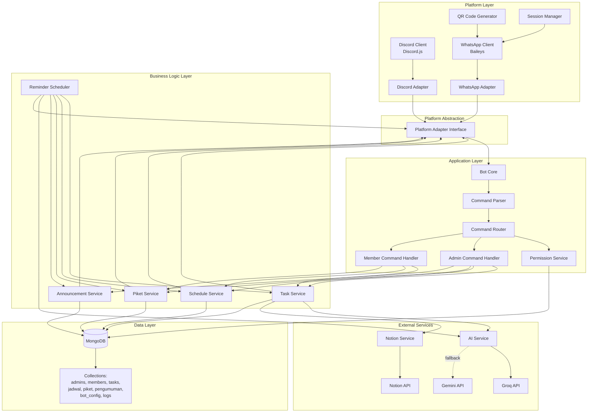

# Design Document: Multi-Platform Class Reminder Bot

## Overview

The Multi-Platform Class Reminder Bot is a Node.js-based system that integrates with both Discord and WhatsApp to provide automated task and schedule management for educational environments. The system follows a modular architecture with a platform abstraction layer that enables unified business logic across both communication platforms. Discord integration uses Discord.js, while WhatsApp integration uses the Baileys library.

### Key Design Decisions

1. **Platform Abstraction Layer**: A unified interface (Platform_Adapter) abstracts platform-specific operations, allowing business logic services to work seamlessly with both Discord and WhatsApp without platform-specific code.

2. **Discord.js for Discord Integration**: Discord.js provides comprehensive Discord API support with features like slash commands, embeds, buttons, and select menus for enhanced user experience.

3. **Baileys for WhatsApp Integration**: Baileys provides a free, open-source solution for WhatsApp Web integration without requiring Meta Business verification or API costs. It maintains session persistence and handles reconnection automatically.

4. **MongoDB for Data Storage**: Document-based storage aligns well with the flexible schema requirements for tasks, schedules, and user data. MongoDB's indexing capabilities support efficient queries for date-based filtering. User records include platform field to support multi-platform users.

5. **AI Service Fallback Pattern**: Primary reliance on Groq API with automatic fallback to Gemini ensures high availability for text formatting features. Both services offer generous free tiers suitable for the target user base.

6. **Cron-based Scheduling**: node-cron provides reliable, timezone-aware scheduling for daily and weekly reminders without requiring external job queue infrastructure. Reminders are sent to both platforms when enabled.

7. **Role-Based Access Control (RBAC)**: Three-tier admin system (Ketua, Wakil, Koordinator) with member role provides flexible permission management suitable for classroom hierarchies. Discord role integration provides additional permission layer for Discord users.

8. **Platform-Specific Message Formatting**: Discord messages use embeds, buttons, and select menus for rich interaction, while WhatsApp messages use text formatting with emojis for optimal display on each platform.

## Architecture

### System Architecture Diagram



### Data Flow

1. **Incoming Message Flow (Discord)**:
   - Discord message → Discord.js client → Discord adapter → Platform interface → Bot core → Command parser → Permission check → Command router → Handler → Service layer → Database/External API → Response formatter → Platform interface → Discord adapter → Discord

2. **Incoming Message Flow (WhatsApp)**:
   - WhatsApp message → Baileys client → WhatsApp adapter → Platform interface → Bot core → Command parser → Permission check → Command router → Handler → Service layer → Database/External API → Response formatter → Platform interface → WhatsApp adapter → WhatsApp

3. **Scheduled Reminder Flow**:
   - Cron trigger → Reminder scheduler → Service layer queries → AI formatting → Response builder → Platform interface → Both adapters → Discord and WhatsApp

4. **Notion Sync Flow**:
   - Sync command → Notion service → Notion API fetch → Task service → Database upsert → Confirmation response → Platform interface → Originating platform

## Components and Interfaces

### 0. Platform Abstraction Layer

#### PlatformAdapter (Interface)
```typescript
interface PlatformAdapter {
  // Get platform name
  getPlatformName(): 'discord' | 'whatsapp'
  
  // Send text message to channel/group
  async sendMessage(content: string): Promise<void>
  
  // Send message with user mentions
  async sendMessageWithMentions(text: string, userIdentifiers: string[]): Promise<void>
  
  // Send formatted task list
  async sendTaskList(tasks: Task[]): Promise<void>
  
  // Send formatted schedule
  async sendSchedule(schedules: Schedule[]): Promise<void>
  
  // Send formatted announcement
  async sendAnnouncement(announcement: Announcement): Promise<void>
  
  // Get user identifier from message context
  getUserIdentifier(context: MessageContext): string
  
  // Format mention for platform
  formatMention(userIdentifier: string): string
  
  // Check if user has admin role (platform-specific)
  async hasAdminRole(userIdentifier: string): Promise<boolean>
}

interface MessageContext {
  platform: 'discord' | 'whatsapp'
  raw: any  // Platform-specific message object
}
```

#### DiscordAdapter
```typescript
class DiscordAdapter implements PlatformAdapter {
  constructor(client: Discord.Client, guildId: string, channelId: string)
  
  getPlatformName(): 'discord'
  
  // Send message using Discord embeds
  async sendMessage(content: string): Promise<void>
  
  // Send message with Discord mentions (<@userId>)
  async sendMessageWithMentions(text: string, userIds: string[]): Promise<void>
  
  // Send task list as embed with color coding and buttons
  async sendTaskList(tasks: Task[]): Promise<void>
  
  // Send schedule as embed with fields
  async sendSchedule(schedules: Schedule[]): Promise<void>
  
  // Send announcement as embed with icon
  async sendAnnouncement(announcement: Announcement): Promise<void>
  
  // Extract Discord user ID from interaction or message
  getUserIdentifier(context: MessageContext): string
  
  // Format Discord mention: <@userId>
  formatMention(userId: string): string
  
  // Check Discord role assignments
  async hasAdminRole(userId: string): Promise<boolean>
  
  // Register slash commands with Discord API
  async registerSlashCommands(commands: SlashCommandDefinition[]): Promise<void>
  
  // Handle slash command interaction
  async handleSlashCommand(interaction: Discord.CommandInteraction): Promise<void>
}

interface SlashCommandDefinition {
  name: string
  description: string
  options?: SlashCommandOption[]
}

interface SlashCommandOption {
  name: string
  description: string
  type: 'string' | 'integer' | 'boolean' | 'user'
  required: boolean
}
```

#### WhatsAppAdapter
```typescript
class WhatsAppAdapter implements PlatformAdapter {
  constructor(client: BaileysClient, groupId: string)
  
  getPlatformName(): 'whatsapp'
  
  // Send text message to WhatsApp group
  async sendMessage(content: string): Promise<void>
  
  // Send message with WhatsApp mentions (@phoneNumber)
  async sendMessageWithMentions(text: string, phoneNumbers: string[]): Promise<void>
  
  // Send task list as formatted text with emojis
  async sendTaskList(tasks: Task[]): Promise<void>
  
  // Send schedule as formatted text
  async sendSchedule(schedules: Schedule[]): Promise<void>
  
  // Send announcement as formatted text with emojis
  async sendAnnouncement(announcement: Announcement): Promise<void>
  
  // Extract phone number from WhatsApp message
  getUserIdentifier(context: MessageContext): string
  
  // Format WhatsApp mention: @phoneNumber
  formatMention(phoneNumber: string): string
  
  // WhatsApp uses database roles only
  async hasAdminRole(phoneNumber: string): Promise<boolean>
}
```

### 1. WhatsApp Connection Layer

#### BaileysClient
```typescript
class BaileysClient {
  constructor(config: BaileysConfig)
  
  // Initialize connection with QR code or saved session
  async connect(): Promise<void>
  
  // Send message to group or individual
  async sendMessage(jid: string, content: MessageContent): Promise<void>
  
  // Send message with mentions
  async sendMessageWithMentions(jid: string, text: string, mentions: string[]): Promise<void>
  
  // Handle incoming messages
  onMessage(handler: (message: WAMessage) => void): void
  
  // Handle connection state changes
  onConnectionUpdate(handler: (update: ConnectionState) => void): void
  
  // Save session data
  async saveSession(): Promise<void>
  
  // Load existing session
  async loadSession(): Promise<boolean>
}

interface BaileysConfig {
  authDir: string
  printQRInTerminal: boolean
  logger: Logger
}

interface MessageContent {
  text?: string
  image?: Buffer
  document?: Buffer
}

interface ConnectionState {
  connection: 'open' | 'close' | 'connecting'
  lastDisconnect?: {
    error: Error
    date: Date
  }
}
```

#### DiscordClient
```typescript
class DiscordClient {
  constructor(config: DiscordConfig)
  
  // Initialize connection with bot token
  async connect(): Promise<void>
  
  // Send message to specific channel
  async sendMessage(channelId: string, content: MessageContent): Promise<void>
  
  // Send embed message
  async sendEmbed(channelId: string, embed: Discord.EmbedBuilder): Promise<void>
  
  // Send message with components (buttons, select menus)
  async sendMessageWithComponents(
    channelId: string, 
    content: string, 
    components: Discord.ActionRowBuilder[]
  ): Promise<void>
  
  // Handle incoming messages
  onMessage(handler: (message: Discord.Message) => void): void
  
  // Handle slash command interactions
  onInteraction(handler: (interaction: Discord.Interaction) => void): void
  
  // Register slash commands
  async registerCommands(commands: SlashCommandDefinition[]): Promise<void>
  
  // Get guild member
  async getGuildMember(guildId: string, userId: string): Promise<Discord.GuildMember>
  
  // Check if user has role
  async userHasRole(guildId: string, userId: string, roleName: string): Promise<boolean>
}

interface DiscordConfig {
  token: string
  guildId: string
  channelId: string
  adminRoleNames: string[]  // Discord role names that map to admin
}

interface MessageContent {
  content?: string
  embeds?: Discord.EmbedBuilder[]
  components?: Discord.ActionRowBuilder[]
}
```

### 2. Command Processing Layer

#### CommandParser
```typescript
class CommandParser {
  // Parse message into command and arguments (supports both platforms)
  parse(message: string, platform: 'discord' | 'whatsapp'): ParsedCommand | null
  
  // Parse Discord slash command interaction
  parseSlashCommand(interaction: Discord.CommandInteraction): ParsedCommand
  
  // Validate command format
  isValidCommand(message: string): boolean
}

interface ParsedCommand {
  command: string
  args: string[]
  rawMessage: string
  platform: 'discord' | 'whatsapp'
}
```

#### CommandRouter
```typescript
class CommandRouter {
  constructor(
    permissionService: PermissionService,
    adminHandler: AdminCommandHandler,
    memberHandler: MemberCommandHandler,
    platformAdapter: PlatformAdapter
  )
  
  // Route command to appropriate handler
  async route(
    command: ParsedCommand, 
    userIdentifier: string, 
    platform: 'discord' | 'whatsapp'
  ): Promise<CommandResponse>
}

interface CommandResponse {
  success: boolean
  message: string
  data?: any
}
```

#### PermissionService
```typescript
class PermissionService {
  constructor(db: MongoDB, platformAdapters: Map<string, PlatformAdapter>)
  
  // Check if user has admin role (checks both database and platform-specific roles)
  async isAdmin(userIdentifier: string, platform: 'discord' | 'whatsapp'): Promise<boolean>
  
  // Get user role from database
  async getUserRole(userIdentifier: string, platform: 'discord' | 'whatsapp'): Promise<UserRole | null>
  
  // Check if user can execute specific command
  async canExecuteCommand(
    userIdentifier: string, 
    platform: 'discord' | 'whatsapp',
    command: string
  ): Promise<boolean>
  
  // Load all admins and members into memory cache
  async loadUsers(): Promise<void>
}

type UserRole = 'ketua' | 'wakil' | 'koordinator' | 'member'

interface PermissionMatrix {
  [command: string]: UserRole[]
}
```

### 3. Business Logic Layer

#### TaskService
```typescript
class TaskService {
  constructor(
    db: MongoDB, 
    aiService: AIService, 
    notionService: NotionService,
    platformAdapters: Map<string, PlatformAdapter>
  )
  
  // Create new task with AI-enhanced description
  async createTask(taskData: TaskInput): Promise<Task>
  
  // Update task field
  async updateTask(taskId: string, field: string, value: any): Promise<Task>
  
  // Delete task
  async deleteTask(taskId: string): Promise<boolean>
  
  // Mark task as complete
  async markComplete(taskId: string): Promise<Task>
  
  // Get tasks by filter
  async getTasks(filter: TaskFilter): Promise<Task[]>
  
  // Calculate priority based on deadline
  calculatePriority(deadline: Date): Priority
  
  // Sync with Notion
  async syncWithNotion(): Promise<SyncResult>
  
  // Send task list to platform
  async sendTaskList(tasks: Task[], platform: 'discord' | 'whatsapp'): Promise<void>
}

interface TaskInput {
  judul: string
  deskripsi: string
  deadline: Date
  mata_pelajaran: string
  tipe: 'individu' | 'kelompok' | 'ujian'
  created_by: string
}

interface Task extends TaskInput {
  _id: string
  prioritas: Priority
  status: 'aktif' | 'selesai'
  notion_id?: string
  created_at: Date
  updated_at: Date
}

type Priority = 'urgent' | 'penting' | 'normal'

interface TaskFilter {
  status?: string
  deadline?: {
    $gte?: Date
    $lte?: Date
  }
  prioritas?: Priority
}

interface SyncResult {
  created: number
  updated: number
  errors: string[]
}
```

#### ScheduleService
```typescript
class ScheduleService {
  constructor(db: MongoDB)
  
  // Create schedule entry
  async createSchedule(scheduleData: ScheduleInput): Promise<Schedule>
  
  // Update schedule
  async updateSchedule(scheduleId: string, field: string, value: any): Promise<Schedule>
  
  // Delete schedule (mark inactive)
  async deleteSchedule(scheduleId: string): Promise<boolean>
  
  // Get schedules by day
  async getSchedulesByDay(day: string): Promise<Schedule[]>
  
  // Get schedules for date range
  async getSchedulesForWeek(startDate: Date): Promise<Schedule[]>
  
  // Create schedule change announcement
  async announceScheduleChange(date: Date, changeInfo: string): Promise<void>
}

interface ScheduleInput {
  hari: string
  jam_mulai: string
  jam_selesai: string
  mata_pelajaran: string
  ruangan: string
  nama_guru: string
}

interface Schedule extends ScheduleInput {
  _id: string
  is_active: boolean
  created_at: Date
}
```

#### PiketService
```typescript
class PiketService {
  constructor(db: MongoDB)
  
  // Set piket for a day
  async setPiket(day: string, students: StudentInfo[]): Promise<Piket>
  
  // Update piket assignment
  async updatePiket(day: string, students: StudentInfo[]): Promise<Piket>
  
  // Get piket for specific day
  async getPiketByDay(day: string): Promise<Piket | null>
  
  // Get piket for week
  async getPiketForWeek(startDate: Date): Promise<Piket[]>
  
  // Format piket message with mentions
  formatPiketMessage(piket: Piket): { text: string, mentions: string[] }
}

interface StudentInfo {
  nama: string
  nomor_wa: string
}

interface Piket {
  _id: string
  hari: string
  nama_siswa: string[]
  nomor_wa: string[]
  created_at: Date
  updated_at: Date
}
```

#### AnnouncementService
```typescript
class AnnouncementService {
  constructor(db: MongoDB)
  
  // Create announcement
  async createAnnouncement(data: AnnouncementInput): Promise<Announcement>
  
  // Delete announcement (mark inactive)
  async deleteAnnouncement(id: string): Promise<boolean>
  
  // Get announcements by date range
  async getAnnouncementsByDateRange(startDate: Date, endDate: Date): Promise<Announcement[]>
  
  // Broadcast message to group
  async broadcast(message: string, urgent: boolean): Promise<void>
}

interface AnnouncementInput {
  tanggal: Date
  judul: string
  tipe: 'acara' | 'perubahan_jadwal' | 'praktikum' | 'lainnya'
  keterangan: string
}

interface Announcement extends AnnouncementInput {
  _id: string
  is_active: boolean
  created_at: Date
}
```

### 4. Scheduler Layer

#### ReminderScheduler
```typescript
class ReminderScheduler {
  constructor(
    taskService: TaskService,
    scheduleService: ScheduleService,
    piketService: PiketService,
    announcementService: AnnouncementService,
    aiService: AIService,
    platformAdapters: Map<string, PlatformAdapter>,
    config: SchedulerConfig
  )
  
  // Initialize cron jobs
  initialize(): void
  
  // Generate and send daily recap to all enabled platforms
  async sendDailyRecap(): Promise<void>
  
  // Generate and send weekly recap to all enabled platforms
  async sendWeeklyRecap(): Promise<void>
  
  // Build daily recap message
  async buildDailyRecap(date: Date): Promise<string>
  
  // Build weekly recap message
  async buildWeeklyRecap(startDate: Date): Promise<string>
  
  // Stop all scheduled jobs
  stop(): void
}

interface SchedulerConfig {
  discordEnabled: boolean
  whatsappEnabled: boolean
  dailyReminderTime: string  // "17:00"
  weeklyReminderDay: number  // 5 for Friday
  weeklyReminderTime: string // "20:00"
  timezone: string           // "Asia/Jakarta"
}
```

### 5. External Services Layer

#### AIService
```typescript
class AIService {
  constructor(groqConfig: AIConfig, geminiConfig: AIConfig)
  
  // Rewrite text with primary service (Groq) and fallback (Gemini)
  async rewriteText(text: string, context: string): Promise<string>
  
  // Format recap message with emojis and structure
  async formatRecap(recapData: RecapData, type: 'daily' | 'weekly'): Promise<string>
  
  // Check service health
  async healthCheck(): Promise<ServiceHealth>
}

interface AIConfig {
  apiKey: string
  model: string
  timeout: number
  maxRetries: number
}

interface RecapData {
  tasks: Task[]
  schedules: Schedule[]
  piket: Piket[]
  announcements: Announcement[]
  statistics?: {
    totalTasks: number
    tasksByType: Record<string, number>
    tasksByPriority: Record<string, number>
  }
}

interface ServiceHealth {
  groq: { available: boolean, latency: number }
  gemini: { available: boolean, latency: number }
}
```

#### NotionService
```typescript
class NotionService {
  constructor(config: NotionConfig)
  
  // Connect to Notion database
  async connect(databaseId: string, apiKey: string): Promise<boolean>
  
  // Fetch all tasks from Notion
  async fetchTasks(): Promise<NotionTask[]>
  
  // Create task in Notion
  async createTask(task: Task): Promise<string>
  
  // Update task status in Notion
  async updateTaskStatus(notionId: string, status: string): Promise<boolean>
  
  // Check connection status
  isConnected(): boolean
}

interface NotionConfig {
  timeout: number
  retryAttempts: number
}

interface NotionTask {
  id: string
  properties: {
    judul: string
    deskripsi: string
    deadline: Date
    mata_pelajaran: string
    tipe: string
    status: string
  }
}
```

### 6. Utility Layer

#### Validator
```typescript
class Validator {
  // Validate date format (YYYY-MM-DD)
  static isValidDate(dateString: string): boolean
  
  // Validate time format (HH:MM)
  static isValidTime(timeString: string): boolean
  
  // Validate phone number format
  static isValidPhoneNumber(phone: string): boolean
  
  // Sanitize user input
  static sanitizeInput(input: string): string
  
  // Validate task type
  static isValidTaskType(type: string): boolean
  
  // Validate priority
  static isValidPriority(priority: string): boolean
  
  // Validate day name
  static isValidDay(day: string): boolean
}
```

#### Formatter
```typescript
class Formatter {
  // Format task list for display
  static formatTaskList(tasks: Task[]): string
  
  // Format schedule for display
  static formatSchedule(schedules: Schedule[]): string
  
  // Format piket assignment
  static formatPiket(piket: Piket): string
  
  // Format announcement
  static formatAnnouncement(announcement: Announcement): string
  
  // Format date to Indonesian format
  static formatDate(date: Date): string
  
  // Format time to HH:MM
  static formatTime(time: string): string
  
  // Add emojis based on content type
  static addEmojis(text: string, type: string): string
}
```

#### Logger
```typescript
class Logger {
  constructor(config: LoggerConfig)
  
  // Log info message
  info(message: string, context?: any): void
  
  // Log error message
  error(message: string, error?: Error, context?: any): void
  
  // Log command execution
  logCommand(command: string, user: string, success: boolean, details?: any): void
  
  // Log AI service request
  logAIRequest(service: string, success: boolean, latency: number): void
  
  // Log database operation
  logDBOperation(operation: string, collection: string, success: boolean): void
  
  // Rotate log files
  async rotateLogs(): Promise<void>
}

interface LoggerConfig {
  logDir: string
  logLevel: 'debug' | 'info' | 'warn' | 'error'
  rotationInterval: 'daily' | 'weekly'
}
```

## Data Models

### MongoDB Collections

#### admins
```javascript
{
  _id: ObjectId,
  nama: String,
  user_identifier: String,  // unique compound index with platform
  platform: String,         // enum: ['discord', 'whatsapp']
  role: String,             // enum: ['ketua', 'wakil', 'koordinator']
  created_at: Date
}
```

#### members
```javascript
{
  _id: ObjectId,
  nama: String,
  user_identifier: String,  // unique compound index with platform
  platform: String,         // enum: ['discord', 'whatsapp']
  kelas: String,
  is_active: Boolean,
  created_at: Date
}
```

#### tasks
```javascript
{
  _id: ObjectId,
  judul: String,
  deskripsi: String,
  deadline: Date,     // index
  mata_pelajaran: String,
  tipe: String,       // enum: ['individu', 'kelompok', 'ujian']
  prioritas: String,  // enum: ['urgent', 'penting', 'normal']
  status: String,     // enum: ['aktif', 'selesai']
  notion_id: String,  // optional
  created_by: String,
  created_at: Date,
  updated_at: Date
}
```

#### jadwal_pelajaran
```javascript
{
  _id: ObjectId,
  hari: String,       // index, enum: ['Senin', 'Selasa', 'Rabu', 'Kamis', 'Jumat', 'Sabtu']
  jam_mulai: String,
  jam_selesai: String,
  mata_pelajaran: String,
  ruangan: String,
  nama_guru: String,
  is_active: Boolean,
  created_at: Date
}
```

#### jadwal_piket
```javascript
{
  _id: ObjectId,
  hari: String,       // unique index
  nama_siswa: [String],
  nomor_wa: [String],
  created_at: Date,
  updated_at: Date
}
```

#### pengumuman_khusus
```javascript
{
  _id: ObjectId,
  tanggal: Date,      // index
  judul: String,
  keterangan: String,
  tipe: String,       // enum: ['acara', 'perubahan_jadwal', 'praktikum', 'lainnya']
  is_active: Boolean,
  created_at: Date
}
```

#### bot_config
```javascript
{
  _id: ObjectId,
  key: String,        // unique index
  value: String,
  description: String,
  updated_at: Date
}

// Default entries:
// { key: 'discord_enabled', value: 'true', description: 'Enable Discord integration' }
// { key: 'discord_guild_id', value: '<discord_guild_id>', description: 'Discord server ID' }
// { key: 'discord_channel_id', value: '<discord_channel_id>', description: 'Discord channel ID for bot messages' }
// { key: 'discord_admin_roles', value: 'Admin,Moderator', description: 'Discord role names that grant admin access' }
// { key: 'whatsapp_enabled', value: 'true', description: 'Enable WhatsApp integration' }
// { key: 'whatsapp_group_id', value: '<whatsapp_group_jid>', description: 'Target WhatsApp group ID' }
// { key: 'daily_reminder_time', value: '17:00', description: 'Daily reminder time in HH:MM' }
// { key: 'weekly_reminder_day', value: '5', description: 'Weekly reminder day (0=Sunday, 5=Friday)' }
// { key: 'weekly_reminder_time', value: '20:00', description: 'Weekly reminder time in HH:MM' }
// { key: 'timezone', value: 'Asia/Jakarta', description: 'Timezone for scheduling' }
// { key: 'notion_database_id', value: '', description: 'Notion database ID' }
// { key: 'notion_api_key', value: '', description: 'Notion API key' }
```

#### logs
```javascript
{
  _id: ObjectId,
  action: String,
  user_wa: String,
  details: Object,
  status: String,     // enum: ['success', 'error']
  created_at: Date    // index
}
```

### Database Indexes

```javascript
// Performance optimization indexes
db.admins.createIndex({ user_identifier: 1, platform: 1 }, { unique: true })
db.members.createIndex({ user_identifier: 1, platform: 1 }, { unique: true })
db.tasks.createIndex({ deadline: 1 })
db.tasks.createIndex({ status: 1 })
db.jadwal_pelajaran.createIndex({ hari: 1 })
db.jadwal_piket.createIndex({ hari: 1 }, { unique: true })
db.pengumuman_khusus.createIndex({ tanggal: 1 })
db.bot_config.createIndex({ key: 1 }, { unique: true })
db.logs.createIndex({ created_at: -1 })
```


## Correctness Properties

*A property is a characteristic or behavior that should hold true across all valid executions of a system—essentially, a formal statement about what the system should do. Properties serve as the bridge between human-readable specifications and machine-verifiable correctness guarantees.*

### User Authentication and Role Management Properties

**Property 1: User verification on command execution**
*For any* command received from a user, the Bot should verify the sender's WhatsApp number against the stored user database before processing the command.
**Validates: Requirements 1.2**

**Property 2: Admin command authorization**
*For any* admin command received, the Bot should validate that the sender has Ketua, Wakil, or Koordinator role before executing the command.
**Validates: Requirements 1.3**

**Property 3: Koordinator role restrictions**
*For any* restricted admin action, when a Koordinator attempts to execute it, the Bot should reject the command and return an error message.
**Validates: Requirements 1.4**

**Property 4: Admin record structure completeness**
*For any* admin record created, it should contain nama, nomor_wa, role, and created_at fields.
**Validates: Requirements 1.5**

**Property 5: Member record structure completeness**
*For any* member record created, it should contain nama, nomor_wa, kelas, is_active, and created_at fields.
**Validates: Requirements 1.6**

**Property 6: Phone number uniqueness constraint**
*For any* attempt to add a user with a nomor_wa that already exists in the database, the Bot should reject the operation and return an error message.
**Validates: Requirements 1.7**

### Task Management Properties

**Property 7: Task record structure completeness**
*For any* task created, it should contain judul, deskripsi, deadline, mata_pelajaran, tipe, prioritas, and status fields.
**Validates: Requirements 2.1**

**Property 8: Automatic priority calculation**
*For any* task created or updated, the Bot should automatically calculate prioritas based on deadline proximity: "urgent" if within 24 hours, "penting" if within 72 hours, otherwise "normal".
**Validates: Requirements 2.2, 2.11, 2.12**

**Property 9: Task field update isolation**
*For any* task and any valid field update, only the specified field should be modified while all other fields remain unchanged.
**Validates: Requirements 2.3**

**Property 10: Task deletion completeness**
*For any* task that is deleted, subsequent queries should not return that task.
**Validates: Requirements 2.4**

**Property 11: Task completion status update**
*For any* active task that is marked complete, its status field should be updated to "selesai".
**Validates: Requirements 2.5**

**Property 12: Active task query filtering and sorting**
*For any* set of tasks in the database, querying all tasks should return only tasks with status "aktif", sorted by deadline in ascending order.
**Validates: Requirements 2.6**

**Property 13: Today's task filtering**
*For any* set of tasks in the database, querying today's tasks should return only tasks with deadline matching the current date.
**Validates: Requirements 2.7**

**Property 14: Weekly task filtering**
*For any* set of tasks in the database, querying this week's tasks should return only tasks with deadline within the next 7 days.
**Validates: Requirements 2.8**

**Property 15: Task type validation**
*For any* task creation or update with tipe field, the value should be one of: individu, kelompok, or ujian, otherwise the operation should be rejected.
**Validates: Requirements 2.9**

**Property 16: Priority validation**
*For any* task creation or update with prioritas field, the value should be one of: urgent, penting, or normal, otherwise the operation should be rejected.
**Validates: Requirements 2.10**

### Schedule Management Properties

**Property 17: Schedule record structure completeness**
*For any* schedule created, it should contain hari, jam_mulai, jam_selesai, mata_pelajaran, ruangan, and nama_guru fields.
**Validates: Requirements 3.1**

**Property 18: Schedule field update isolation**
*For any* schedule and any valid field update, only the specified field should be modified while all other fields remain unchanged.
**Validates: Requirements 3.2**

**Property 19: Schedule soft deletion**
*For any* schedule that is deleted, its is_active field should be set to false rather than removing the record.
**Validates: Requirements 3.3**

**Property 20: Schedule change announcement creation**
*For any* schedule change announcement, a corresponding announcement record should be created with tipe "perubahan_jadwal".
**Validates: Requirements 3.4**

**Property 21: Daily schedule query filtering and sorting**
*For any* set of schedules in the database, querying today's schedule should return only active schedules for the current day, sorted by jam_mulai in ascending order.
**Validates: Requirements 3.5**

**Property 22: Tomorrow's schedule query filtering and sorting**
*For any* set of schedules in the database, querying tomorrow's schedule should return only active schedules for the next day, sorted by jam_mulai in ascending order.
**Validates: Requirements 3.6**

**Property 23: Weekly schedule query filtering and grouping**
*For any* set of schedules in the database, querying this week's schedule should return only active schedules for the current week, organized by day.
**Validates: Requirements 3.7**

**Property 24: Day name validation**
*For any* schedule creation or update with hari field, the value should be one of: Senin, Selasa, Rabu, Kamis, Jumat, or Sabtu, otherwise the operation should be rejected.
**Validates: Requirements 3.8**

### Piket Management Properties

**Property 25: Piket record structure completeness**
*For any* piket assignment created or updated, it should contain hari, nama_siswa array, and nomor_wa array fields.
**Validates: Requirements 4.1**

**Property 26: Piket assignment update**
*For any* piket day that is updated, the new assignment should replace the previous assignment for that day.
**Validates: Requirements 4.2**

**Property 27: Daily piket query filtering**
*For any* set of piket assignments in the database, querying today's piket should return only the assignment for the current day.
**Validates: Requirements 4.3**

**Property 28: Weekly piket query filtering**
*For any* set of piket assignments in the database, querying this week's piket should return all assignments for the current week.
**Validates: Requirements 4.4**

**Property 29: Piket array parallelism invariant**
*For any* piket record, the nama_siswa and nomor_wa arrays should have the same length, with matching indices representing the same student.
**Validates: Requirements 4.5**

**Property 30: Piket mention formatting**
*For any* piket assignment displayed, the formatted message should include WhatsApp mentions for all students in the nomor_wa array.
**Validates: Requirements 4.6**

### Announcement Management Properties

**Property 31: Announcement record structure completeness**
*For any* announcement created, it should contain tanggal, judul, tipe, and keterangan fields.
**Validates: Requirements 5.1**

**Property 32: Announcement soft deletion**
*For any* announcement that is deleted, its is_active field should be set to false rather than removing the record.
**Validates: Requirements 5.2**

**Property 33: Announcement type validation**
*For any* announcement creation or update with tipe field, the value should be one of: acara, perubahan_jadwal, praktikum, or lainnya, otherwise the operation should be rejected.
**Validates: Requirements 5.3**

**Property 34: Announcement query filtering and sorting**
*For any* set of announcements in the database, querying announcements should return only records with is_active true, sorted by tanggal.
**Validates: Requirements 5.6**

### Automated Reminder Properties

**Property 35: Daily recap schedule inclusion**
*For any* set of schedules in the database, the daily recap should include all active schedules for tomorrow, sorted by jam_mulai.
**Validates: Requirements 6.3**

**Property 36: Daily recap task inclusion**
*For any* set of tasks in the database, the daily recap should include all active tasks with deadline matching tomorrow or within 48 hours.
**Validates: Requirements 6.4**

**Property 37: Daily recap piket inclusion with mentions**
*For any* piket assignment for tomorrow, the daily recap should include it with WhatsApp mentions for all assigned students.
**Validates: Requirements 6.5**

**Property 38: Daily recap announcement inclusion**
*For any* set of announcements in the database, the daily recap should include all active announcements with tanggal matching tomorrow.
**Validates: Requirements 6.6**

**Property 39: Weekly recap task categorization**
*For any* set of tasks in the database, the weekly recap should include all active tasks for the next 7 days, categorized by prioritas.
**Validates: Requirements 7.3**

**Property 40: Weekly recap announcement inclusion**
*For any* set of announcements in the database, the weekly recap should include all active announcements with tanggal within the next 7 days.
**Validates: Requirements 7.4**

**Property 41: Weekly recap task statistics by type**
*For any* set of tasks in the database, the weekly recap should include summary statistics showing the count of tasks grouped by tipe.
**Validates: Requirements 7.5**

**Property 42: Weekly recap task statistics by priority**
*For any* set of tasks in the database, the weekly recap should include summary statistics showing the count of tasks grouped by prioritas.
**Validates: Requirements 7.6**

### AI Service Properties

**Property 43: AI service invocation for task description**
*For any* task created with deskripsi, the Bot should send the text to Groq_Service for rewriting.
**Validates: Requirements 8.1**

**Property 44: AI service fallback mechanism**
*For any* AI service request where Groq_Service fails or times out, the Bot should automatically fallback to Gemini_Service.
**Validates: Requirements 8.2**

**Property 45: AI service failure graceful degradation**
*For any* AI service request where both Groq_Service and Gemini_Service fail, the Bot should use the original text without modification.
**Validates: Requirements 8.3**

**Property 46: Daily recap AI formatting**
*For any* daily recap generation, the Bot should use Groq_Service to format the message with emojis and structure.
**Validates: Requirements 8.4**

**Property 47: Weekly recap AI formatting**
*For any* weekly recap generation, the Bot should use Groq_Service to format the message with emojis and structure.
**Validates: Requirements 8.5**

**Property 48: AI service request logging**
*For any* AI service request, the Bot should create a log entry with service name, success status, and response time.
**Validates: Requirements 8.6**

**Property 49: AI service timeout enforcement**
*For any* AI service request that exceeds 10 seconds, the Bot should terminate the request and trigger the fallback mechanism.
**Validates: Requirements 8.7**

### Notion Integration Properties

**Property 50: Notion configuration storage**
*For any* /connect_notion command execution, the Bot should store the database_id and api_key in the bot_config collection.
**Validates: Requirements 9.1**

**Property 51: Notion sync task creation**
*For any* Notion task that does not exist in MongoDB_Collection (no matching notion_id), the sync operation should create a new task record.
**Validates: Requirements 9.3**

**Property 52: Notion sync task update**
*For any* Notion task with a matching notion_id in MongoDB_Collection, the sync operation should update the existing task record.
**Validates: Requirements 9.4**

**Property 53: Notion bidirectional sync on completion**
*For any* task marked complete in the Bot, the corresponding Notion_Database entry should be updated with the new status.
**Validates: Requirements 9.5**

**Property 54: Notion bidirectional sync on creation**
*For any* task created via Bot command, a corresponding entry should be created in Notion_Database.
**Validates: Requirements 9.6**

**Property 55: Notion failure graceful degradation**
*For any* Notion API failure, the Bot should log the error and continue operation without synchronization.
**Validates: Requirements 9.7**

**Property 56: Notion ID storage for sync**
*For any* task synced with Notion, the task record should contain a notion_id field for bidirectional synchronization.
**Validates: Requirements 9.8**

### Command Processing Properties

**Property 57: Command recognition**
*For any* message starting with "/", the Bot should parse it as a command.
**Validates: Requirements 11.1**

**Property 58: Command parsing extraction**
*For any* valid command message, the parser should extract the command name and arguments correctly.
**Validates: Requirements 11.2**

**Property 59: Command argument delimiter splitting**
*For any* command with arguments containing "|" delimiter, the parser should split arguments by this delimiter.
**Validates: Requirements 11.3**

**Property 60: Command routing by role**
*For any* command received, the Bot should route it to the appropriate handler based on the sender's user role.
**Validates: Requirements 11.4**

**Property 61: Invalid command error handling**
*For any* invalid command received, the Bot should respond with an error message and suggest using /help.
**Validates: Requirements 11.5**

**Property 62: Role-based help display**
*For any* /help or /bantuan command, the Bot should display available commands filtered by the sender's user role.
**Validates: Requirements 11.6**

**Property 63: Command argument whitespace normalization**
*For any* command with arguments, the Bot should trim whitespace from all arguments before processing.
**Validates: Requirements 11.8**

### Input Validation Properties

**Property 64: Date format validation**
*For any* date argument provided, the Bot should validate it matches YYYY-MM-DD format before processing.
**Validates: Requirements 12.1**

**Property 65: Time format validation**
*For any* time argument provided, the Bot should validate it matches HH:MM format before processing.
**Validates: Requirements 12.2**

**Property 66: Missing argument error handling**
*For any* command with missing required arguments, the Bot should respond with usage instructions for that command.
**Validates: Requirements 12.3**

**Property 67: Invalid task ID error handling**
*For any* invalid task ID provided, the Bot should respond with an error message.
**Validates: Requirements 12.4**

**Property 68: Invalid schedule ID error handling**
*For any* invalid schedule ID provided, the Bot should respond with an error message.
**Validates: Requirements 12.5**

**Property 69: Database failure error handling**
*For any* database operation failure, the Bot should log the error and respond with a user-friendly message.
**Validates: Requirements 12.6**

**Property 70: Unhandled exception recovery**
*For any* unhandled exception, the Bot should log the full error stack and continue operation without crashing.
**Validates: Requirements 12.7**

**Property 71: Input sanitization**
*For any* user input received, the Bot should sanitize it to prevent injection attacks before processing.
**Validates: Requirements 12.8**

### Logging Properties

**Property 72: Command execution logging**
*For any* command executed, the Bot should create a log entry with action, user_wa, details, status, and timestamp.
**Validates: Requirements 13.1**

**Property 73: Database operation logging**
*For any* database operation performed, the Bot should create a log entry with operation type and result.
**Validates: Requirements 13.2**

**Property 74: AI service request logging**
*For any* AI service request made, the Bot should create a log entry with service used, success status, and response time.
**Validates: Requirements 13.3**

**Property 75: Error logging completeness**
*For any* error that occurs, the Bot should create a log entry with error message, stack trace, and context.
**Validates: Requirements 13.4**

**Property 76: Dual logging output**
*For any* log entry created, it should be written to both console and log files in the logs directory.
**Validates: Requirements 13.5**

**Property 77: Connection state change logging**
*For any* WhatsApp connection state change, the Bot should create a log entry documenting the change.
**Validates: Requirements 10.7**

### Configuration Management Properties

**Property 78: Configuration storage**
*For any* runtime configuration value, it should be stored in the bot_config MongoDB_Collection.
**Validates: Requirements 14.2**

**Property 79: Configuration validation**
*For any* configuration value update, the Bot should validate the value before applying it.
**Validates: Requirements 14.5**

**Property 80: Invalid configuration rejection**
*For any* invalid configuration value provided, the Bot should reject the change and log an error.
**Validates: Requirements 14.6**

### Data Persistence Properties

**Property 81: Multi-collection transaction usage**
*For any* operation affecting multiple collections, the Bot should use MongoDB transactions to ensure atomicity.
**Validates: Requirements 15.4**

**Property 82: Transaction rollback on failure**
*For any* transaction that fails, the Bot should rollback all changes and log the error.
**Validates: Requirements 15.5**

**Property 83: Schema validation before insertion**
*For any* data insertion into MongoDB_Collection, the Bot should validate the data schema before performing the insertion.
**Validates: Requirements 15.7**

### Platform Abstraction Properties

**Property 84: Platform adapter message sending**
*For any* message sent through Platform_Adapter, it should be delivered to the correct platform (Discord or WhatsApp) based on the adapter instance.
**Validates: Requirements 16.2**

**Property 85: Platform-specific user identifier extraction**
*For any* message context, Platform_Adapter.getUserIdentifier should return the correct platform-specific identifier (Discord user ID or WhatsApp phone number).
**Validates: Requirements 16.4**

**Property 86: Platform-specific mention formatting**
*For any* user identifier and platform, Platform_Adapter.formatMention should return the correct mention syntax for that platform.
**Validates: Requirements 16.7**

**Property 87: Platform adapter interface consistency**
*For any* Platform_Adapter implementation (Discord or WhatsApp), all interface methods should be implemented and functional.
**Validates: Requirements 16.1**

### Discord Integration Properties

**Property 88: Discord client connection**
*For any* Discord bot token, when Discord mode is enabled, the Bot should successfully connect to Discord and log guild information.
**Validates: Requirements 17.1, 17.2**

**Property 89: Discord slash command registration**
*For any* set of commands, when Discord client initializes, all commands should be registered as slash commands with Discord API.
**Validates: Requirements 17.5**

**Property 90: Discord slash command parsing**
*For any* Discord slash command interaction, the Bot should parse it correctly and route to the appropriate handler.
**Validates: Requirements 17.3**

**Property 91: Discord text command parsing**
*For any* Discord message starting with "/", the Bot should parse it as a text command and route to the appropriate handler.
**Validates: Requirements 17.4**

**Property 92: Discord embed formatting for tasks**
*For any* task list sent to Discord, it should be formatted as an embed with color coding based on priority.
**Validates: Requirements 17.6, 19.1**

**Property 93: Discord button interaction**
*For any* task list displayed on Discord, interactive buttons should be included for common actions.
**Validates: Requirements 17.7**

**Property 94: Discord select menu interaction**
*For any* option selection on Discord, select menus should be used for user-friendly selection.
**Validates: Requirements 17.8**

**Property 95: Discord role-based permissions**
*For any* Discord user with configured admin role, the Bot should grant admin permissions.
**Validates: Requirements 17.9, 17.10**

### Multi-Platform User Management Properties

**Property 96: Platform field storage**
*For any* user record created, it should contain a platform field indicating 'discord' or 'whatsapp'.
**Validates: Requirements 18.1**

**Property 97: User identifier storage**
*For any* user record created, it should contain a user_identifier field with the platform-specific ID.
**Validates: Requirements 18.2**

**Property 98: Platform-specific identifier validation**
*For any* user creation, the Bot should validate the user_identifier format based on the platform field.
**Validates: Requirements 18.3**

**Property 99: Multi-platform user support**
*For any* user, the Bot should support having separate accounts on both Discord and WhatsApp with different user_identifiers.
**Validates: Requirements 18.5**

**Property 100: Platform-aware user identification**
*For any* command execution, the Bot should identify the user by the combination of platform and user_identifier.
**Validates: Requirements 18.6**

### Multi-Platform Message Formatting Properties

**Property 101: Discord task list embed formatting**
*For any* task list sent to Discord, it should be formatted as an embed with color coding by priority.
**Validates: Requirements 19.1**

**Property 102: WhatsApp task list text formatting**
*For any* task list sent to WhatsApp, it should be formatted as text with emojis.
**Validates: Requirements 19.2**

**Property 103: Discord schedule embed formatting**
*For any* schedule sent to Discord, it should use embed fields for structured display.
**Validates: Requirements 19.3**

**Property 104: WhatsApp schedule text formatting**
*For any* schedule sent to WhatsApp, it should use text formatting with line breaks.
**Validates: Requirements 19.4**

**Property 105: Discord mention syntax**
*For any* user mention on Discord, the Bot should use Discord mention syntax (<@user_id>).
**Validates: Requirements 19.5**

**Property 106: WhatsApp mention syntax**
*For any* user mention on WhatsApp, the Bot should use WhatsApp mention syntax (@phone_number).
**Validates: Requirements 19.6**

### Multi-Platform Configuration Properties

**Property 107: Discord configuration loading**
*For any* Discord mode initialization, the Bot should load Discord bot token, guild ID, and channel ID from configuration.
**Validates: Requirements 20.1, 20.2**

**Property 108: WhatsApp configuration loading**
*For any* WhatsApp mode initialization, the Bot should load WhatsApp group ID from configuration.
**Validates: Requirements 20.3**

**Property 109: Dual platform support**
*For any* configuration where both platforms are enabled, the Bot should initialize and operate both Discord and WhatsApp clients simultaneously.
**Validates: Requirements 20.4**

**Property 110: Multi-platform reminder broadcasting**
*For any* scheduled reminder when both platforms are enabled, the Bot should send the reminder to both Discord and WhatsApp.
**Validates: Requirements 20.5**

**Property 111: Platform-specific configuration keys**
*For any* platform-specific configuration, it should be stored with the appropriate platform prefix (discord_* or whatsapp_*).
**Validates: Requirements 20.6**

**Property 112: Platform disable handling**
*For any* platform that is disabled in configuration, the Bot should skip initialization for that platform.
**Validates: Requirements 20.7**

## Error Handling

### Error Categories and Strategies

#### 1. Discord Connection Errors
- **Invalid Bot Token**: Log error and exit with clear message indicating token issue
- **Missing Permissions**: Log specific permission requirements and notify admin
- **Guild Not Found**: Verify guild ID in configuration and log error
- **Channel Not Found**: Verify channel ID in configuration and log error
- **Rate Limiting**: Implement exponential backoff and queue messages
- **Connection Loss**: Implement automatic reconnection with Discord.js built-in retry

#### 2. WhatsApp Connection Errors
- **QR Code Timeout**: If QR code is not scanned within 60 seconds, regenerate and display new QR code
- **Connection Loss**: Implement exponential backoff retry (1s, 2s, 4s, 8s, 16s) up to 5 attempts
- **Session Corruption**: Delete corrupted session files and force new authentication
- **Rate Limiting**: Implement message queue with 1-second delay between messages to avoid WhatsApp rate limits

#### 2. WhatsApp Connection Errors
- **QR Code Timeout**: If QR code is not scanned within 60 seconds, regenerate and display new QR code
- **Connection Loss**: Implement exponential backoff retry (1s, 2s, 4s, 8s, 16s) up to 5 attempts
- **Session Corruption**: Delete corrupted session files and force new authentication
- **Rate Limiting**: Implement message queue with 1-second delay between messages to avoid WhatsApp rate limits

#### 3. Database Errors
- **Connection Failure**: Retry connection every 5 seconds up to 10 times, then exit with error code
- **Query Timeout**: Set 30-second timeout for all queries, log and return error on timeout
- **Duplicate Key**: Catch duplicate key errors and return user-friendly message
- **Transaction Failure**: Rollback all changes and log full error context
- **Schema Validation**: Validate all data before insertion, reject invalid data with descriptive error

#### 4. AI Service Errors
- **Groq Timeout**: After 10 seconds, cancel request and fallback to Gemini
- **Groq API Error**: Log error details and immediately fallback to Gemini
- **Gemini Timeout**: After 10 seconds, cancel request and use original text
- **Both Services Fail**: Use original text without modification, log failure for monitoring
- **Rate Limit**: Implement exponential backoff and queue requests

#### 5. Notion API Errors
- **Authentication Failure**: Log error and disable Notion sync until reconnection
- **Database Not Found**: Log error and notify admin via both platforms
- **Rate Limit**: Implement exponential backoff and queue sync requests
- **Network Timeout**: Retry up to 3 times with 5-second delay, then log and continue
- **Invalid Data**: Log specific validation errors and skip problematic entries

#### 6. Command Processing Errors
- **Invalid Command**: Return error message with command suggestion and /help reference
- **Missing Arguments**: Return usage instructions with example
- **Invalid Arguments**: Return specific validation error (e.g., "Invalid date format, use YYYY-MM-DD")
- **Permission Denied**: Return clear message indicating insufficient permissions
- **Resource Not Found**: Return specific error (e.g., "Task with ID 123 not found")

#### 7. Scheduler Errors
- **Cron Job Failure**: Log error and attempt to reschedule job
- **Recap Generation Failure**: Log error with full context, send admin notification to all platforms
- **Message Send Failure**: Retry up to 3 times per platform, log if all attempts fail

#### 8. Platform Adapter Errors
- **Unsupported Platform**: Log error and reject operation
- **Platform Client Not Initialized**: Log error and skip operation for that platform
- **Message Format Error**: Log error and fallback to plain text
- **Mention Format Error**: Log error and use plain text instead of mention

### Error Response Format

All error responses should follow this structure:
```javascript
{
  success: false,
  error: {
    code: 'ERROR_CODE',
    message: 'User-friendly error message',
    details: 'Technical details for logging'
  }
}
```

### Error Logging Strategy

All errors should be logged with:
- Timestamp
- Error type/category
- Error message
- Stack trace (for exceptions)
- Context (user, command, data involved)
- Severity level (warning, error, critical)

Critical errors (database connection failure, bot crash) should trigger admin notifications via WhatsApp.

## Testing Strategy

### Dual Testing Approach

The testing strategy employs both unit testing and property-based testing as complementary approaches:

- **Unit Tests**: Verify specific examples, edge cases, and error conditions
- **Property Tests**: Verify universal properties across all inputs through randomization
- Together they provide comprehensive coverage: unit tests catch concrete bugs, property tests verify general correctness

### Property-Based Testing Configuration

**Library Selection**: Use `fast-check` for Node.js/TypeScript property-based testing

**Test Configuration**:
- Minimum 100 iterations per property test (due to randomization)
- Each property test must reference its design document property
- Tag format: `// Feature: whatsapp-class-reminder-bot, Property {number}: {property_text}`

**Example Property Test Structure**:
```typescript
import fc from 'fast-check';

// Feature: whatsapp-class-reminder-bot, Property 8: Automatic priority calculation
test('Task priority is calculated based on deadline proximity', () => {
  fc.assert(
    fc.property(
      fc.date({ min: new Date(), max: new Date(Date.now() + 7 * 24 * 60 * 60 * 1000) }),
      (deadline) => {
        const task = createTask({ deadline });
        const now = new Date();
        const hoursUntilDeadline = (deadline.getTime() - now.getTime()) / (1000 * 60 * 60);
        
        if (hoursUntilDeadline <= 24) {
          expect(task.prioritas).toBe('urgent');
        } else if (hoursUntilDeadline <= 72) {
          expect(task.prioritas).toBe('penting');
        } else {
          expect(task.prioritas).toBe('normal');
        }
      }
    ),
    { numRuns: 100 }
  );
});
```

### Unit Testing Strategy

**Framework**: Jest for Node.js/TypeScript

**Test Organization**:
- One test file per service/handler class
- Group related tests using `describe` blocks
- Use `beforeEach` for test setup and cleanup

**Coverage Targets**:
- Core business logic: 90%+ coverage
- Command handlers: 85%+ coverage
- Utility functions: 95%+ coverage
- Integration points: 80%+ coverage

**Key Unit Test Areas**:
1. Command parsing with various input formats
2. Permission checking for different user roles
3. Date/time validation edge cases
4. Error handling for each error category
5. Message formatting with special characters
6. Database query result transformation
7. AI service fallback mechanism
8. Notion sync conflict resolution

### Integration Testing

**Test Scenarios**:
1. End-to-end command execution flow
2. Scheduled reminder generation and delivery
3. Notion bidirectional synchronization
4. AI service fallback chain
5. Database transaction rollback
6. WhatsApp connection recovery

**Test Environment**:
- Use MongoDB in-memory server for database tests
- Mock WhatsApp client for message sending
- Mock AI services with configurable responses
- Mock Notion API with test database

### Testing Best Practices

1. **Isolation**: Each test should be independent and not rely on other tests
2. **Determinism**: Tests should produce consistent results across runs
3. **Speed**: Unit tests should complete in milliseconds, integration tests in seconds
4. **Clarity**: Test names should clearly describe what is being tested
5. **Maintainability**: Use test helpers and factories to reduce duplication
6. **Coverage**: Focus on critical paths and edge cases, not just line coverage

### Continuous Testing

- Run unit tests on every commit
- Run property tests on pull requests
- Run integration tests before deployment
- Monitor test execution time and optimize slow tests
- Track flaky tests and fix root causes
